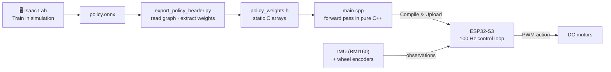
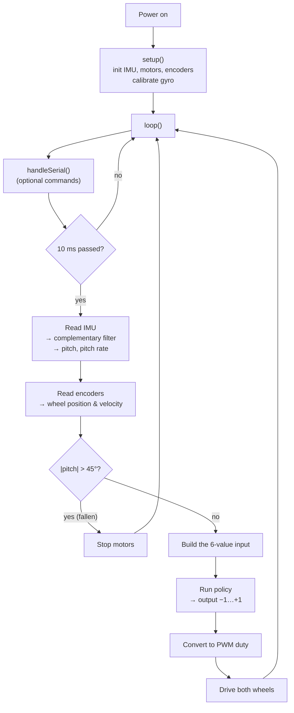

# Self-Balancing TWIP Robot (Isaac Lab)
# Training Self-Balance Robot on Isaac Sim/Issac Lab
## Overview

This project trains a two-wheeled self-balancing robot (a "TWIP" — two-wheeled inverted pendulum)
with reinforcement learning in Isaac Lab, then deploys the trained policy to real hardware.

The end-to-end workflow is:

```text
recreate the 2-wheel robot as a URDF -> import it into Isaac Sim
      -> train a balancing / velocity-tracking task with RSL-RL (PPO)
      -> evaluate the policy and export it to .onnx
      -> convert the exported policy to a C array/header -> flash it onto an ESP32
```

- The robot chassis was modeled in CAD and exported as a URDF with STL meshes
  (`assets/RobotTwoWheel/`), imported directly into Isaac Sim at simulation start (no prebaked USD),
  so the simulated robot never drifts out of sync with the CAD source.
- Training uses Isaac Lab's manager-based RL environment (`source/SelfBalancing/`) with RSL-RL/PPO:
  the robot balances upright while tracking a randomly commanded forward/backward body velocity.
- `scripts/rsl_rl/play.py` evaluates a trained checkpoint and automatically exports it to both
  `policy.pt` (JIT) and `policy.onnx` under `logs/rsl_rl/<experiment>/<run>/exported/`.
- Converting that `.onnx` file into a C array/header and flashing it onto an ESP32 is the final,
  sim-to-real step of the pipeline; this repository currently covers everything up to the ONNX
  export, and the ONNX-to-firmware conversion/flashing tooling is not included here yet.

This structure (and the requirements/troubleshooting sections below) follows the layout of
[sim2real-line-following-robot](https://github.com/SangHuynhVan272/sim2real-line-following-robot), a
similar sim-to-real Isaac Lab -> ESP32 project, adapted to this robot and to a Ubuntu-only workflow.

### Policy input/output

The policy is a small MLP (`actor_hidden_dims=[32, 32]` in `agents/rsl_rl_ppo_cfg.py`) that maps 7
observations straight to 2 wheel torques, no PID loop in between:

```text
[pitch angle, pitch rate, wheel_L distance, wheel_R distance, wheel_L velocity, wheel_R velocity,
 target velocity] -> MLP 7 -> 32 -> 32 -> 2 -> [wheel_L torque, wheel_R torque]
```

| # | Observation (input) | Source | Unit |
|---|---|---|---|
| 1 | pitch angle | `mdp.imu_pitch_angle` | rad |
| 2 | pitch rate | `mdp.imu_pitch_rate` | rad/s |
| 3 | wheel_L distance traveled | `mdp.wheel_distance` (`joint_L`) | m |
| 4 | wheel_R distance traveled | `mdp.wheel_distance` (`joint_R`) | m |
| 5 | wheel_L angular velocity | `mdp.joint_vel` (`joint_L`) | rad/s |
| 6 | wheel_R angular velocity | `mdp.joint_vel` (`joint_R`) | rad/s |
| 7 | target body velocity | `mdp.generated_commands` (`target_velocity`) | m/s |

| # | Action (output) | Range | Unit |
|---|---|---|---|
| 1 | wheel_L torque command | raw `[-1, 1]` scaled by `MOTOR_TORQUE_MAX` | Nm, `[-0.49, 0.49]` |
| 2 | wheel_R torque command | raw `[-1, 1]` scaled by `MOTOR_TORQUE_MAX` | Nm, `[-0.49, 0.49]` |

The exported `policy.onnx`/`policy.pt` (see [Evaluate a trained policy and export
it](#evaluate-a-trained-policy-and-export-it)) keeps this exact 7-in/2-out contract — the ESP32
firmware needs to feed it observations in this order and units, and apply the same `[-1, 1] ->
torque` scaling to its raw output.

**Keywords:** self-balancing robot, TWIP, reinforcement learning, Isaac Lab, RSL-RL, PPO, sim-to-real, ESP32

## 1. What is included

| Path                                                             | Purpose                                                      |
| ----------------------------------------------------------------- | ------------------------------------------------------------ |
| `assets/RobotTwoWheel/`                                          | URDF + STL meshes for the physical robot chassis              |
| `source/SelfBalancing/SelfBalancing/tasks/manager_based/selfbalancing/` | Robot config, MDP terms (actions/commands/events/observations/rewards/terminations), env config |
| `source/SelfBalancing/SelfBalancing/tasks/manager_based/selfbalancing/agents/` | RSL-RL PPO hyperparameters                                     |
| `scripts/rsl_rl/train.py`, `scripts/rsl_rl/play.py`               | Train / evaluate + export (.pt and .onnx) programs             |
| `scripts/list_envs.py`, `scripts/zero_agent.py`, `scripts/random_agent.py` | Sanity-check scripts (list registered tasks, zero/random action rollouts) |
| `logs/rsl_rl/selfbalancing/<timestamp>/`                          | Per-run checkpoints, TensorBoard logs, and `exported/policy.onnx` |

## 2. Requirements

This guide covers Ubuntu only (22.04 LTS or 24.04 LTS).

- an NVIDIA RTX GPU with a recent driver (this project was developed and tested with the setup
  below); NVIDIA publishes the current GPU/VRAM/driver requirements for your Isaac Sim version in the
  [Isaac Sim requirements docs](https://docs.isaacsim.omniverse.nvidia.com/latest/installation/requirements.html) —
  run `nvidia-smi` first and repair the NVIDIA driver before installing anything if it fails;
- a stable internet connection for the first Isaac Sim launch (extension/shader downloads).

Tested with:

| Component | Version |
|---|---:|
| OS | Ubuntu 24.04 LTS |
| GPU / driver | NVIDIA RTX 3080 (10 GB VRAM) / 580.173.02 |
| Python | 3.11 |
| Isaac Sim | 5.1.0 |
| Isaac Lab | v2.3.2 |
| PyTorch | 2.7.0, CUDA 12.8 build |
| RSL-RL | 3.1.2 |
| NumPy | 1.26.0 |
| ONNX | 1.20.1 |

These are the versions this repository was validated against, not a hard requirement — but a
different `rsl-rl-lib`/Isaac Lab combination can change the RL config API (see Troubleshooting).

## 3. Install on Ubuntu 22.04 or 24.04

### 3.1 Create the Python environment

```bash
conda create -n env_isaaclab python=3.11 -y
conda activate env_isaaclab
python -m pip install --upgrade pip
```

The prompt must begin with `(env_isaaclab)` for every command below.

### 3.2 Install Isaac Sim and PyTorch

```bash
python -m pip install "isaacsim[all,extscache]==5.1.0" --extra-index-url https://pypi.nvidia.com
python -m pip install --upgrade --force-reinstall torch==2.7.0 torchvision==0.22.0 torchaudio==2.7.0 --index-url https://download.pytorch.org/whl/cu128
```

Start Isaac Sim once, accept the EULA, and let it finish downloading extensions/building shader
caches (can take more than ten minutes on the first launch), then close it:

```bash
isaacsim
```

### 3.3 Install Isaac Lab

```bash
cd ~
git clone https://github.com/isaac-sim/IsaacLab.git
cd IsaacLab
git checkout v2.3.2
./isaaclab.sh --install rsl_rl
```

### 3.4 Install this project

Clone or copy this repository outside of the `IsaacLab` directory, then, using the Python
interpreter that has Isaac Lab installed:

```bash
python -m pip install -e source/SelfBalancing
```

## 4. Verify the installation

List the registered tasks (`Template-SelfBalancing-v0` and `Template-SelfBalancing-Play-v0` should
appear — note the search pattern `"Template-"` in `scripts/list_envs.py`):

```bash
python scripts/list_envs.py
```

Run a zero-action or random-action rollout to confirm the environment itself is configured
correctly, before spending time on training:

```bash
python scripts/zero_agent.py --task=Template-SelfBalancing-v0
python scripts/random_agent.py --task=Template-SelfBalancing-v0
```

### Set up IDE (Optional)

- Run VSCode Tasks, by pressing `Ctrl+Shift+P`, selecting `Tasks: Run Task` and running the
  `setup_python_env` in the drop down menu. When running this task, you will be prompted to add the
  absolute path to your Isaac Sim installation.

If everything executes correctly, it should create a file `.python.env` in the `.vscode` directory,
containing the python paths to all the extensions provided by Isaac Sim and Omniverse — this helps
with indexing for intelligent code suggestions.

### Setup as Omniverse Extension (Optional)

An example UI extension loads upon enabling your extension, defined in
`source/SelfBalancing/SelfBalancing/ui_extension_example.py`.

1. **Add the search path of this project/repository** to the extension manager:
    - Navigate to the extension manager using `Window` -> `Extensions`.
    - Click on the **Hamburger Icon**, then go to `Settings`.
    - In the `Extension Search Paths`, enter the absolute path to the `source` directory of this project.
    - If not already present, also add the path to Isaac Lab's extension directory (`IsaacLab/source`).
    - Click on the **Hamburger Icon**, then click `Refresh`.

2. **Search and enable your extension**:
    - Find your extension under the `Third Party` category.
    - Toggle it to enable your extension.

## 5. Train and export your policy

Two task variants are registered: `Template-SelfBalancing-v0` (training, 8196 parallel envs) and
`Template-SelfBalancing-Play-v0` (playback/evaluation, 36 envs, no observation noise — see
`SelfBalancingEnvCfg_PLAY` in `selfbalancing_env_cfg.py`). The robot's task is to stay upright while
tracking a randomly commanded forward/backward body velocity (-0.4 to 0.4 m/s).

### Train

```bash
python scripts/rsl_rl/train.py --task=Template-SelfBalancing-v0 --headless
```

Drop `--headless` to watch training in the viewport (much slower). Useful flags:

- `--num_envs <N>` — override the number of parallel environments.
- `--max_iterations <N>` — number of PPO iterations to run.
- `--seed <N>` — environment seed.

Logs and checkpoints are saved under `logs/rsl_rl/<experiment_name>/<timestamp>/` (`experiment_name`
is set in `agents/rsl_rl_ppo_cfg.py`).

### Resume training

```bash
python scripts/rsl_rl/train.py --task=Template-SelfBalancing-v0 --headless \
    --resume --load_run <run_dir_name> --checkpoint <model_XXX.pt> --max_iterations <N>
```

`--max_iterations` adds `<N>` more iterations on top of the resumed checkpoint, not a total target.
Omit `--load_run`/`--checkpoint` to auto-pick the most recent run and its latest checkpoint.
Resuming only works if the observation/action dimensions haven't changed since that checkpoint was
trained (other config changes, e.g. reward weights, are fine to resume across).

### Evaluate a trained policy and export it

```bash
python scripts/rsl_rl/play.py --task=Template-SelfBalancing-Play-v0 \
    --load_run <run_dir_name> --checkpoint <model_XXX.pt>
```

This both plays the policy in the viewport (add `--real-time` to pace it to real time, or `--video`
to record instead of watching live) and exports it, writing `policy.pt` (JIT) and `policy.onnx` to
`logs/rsl_rl/selfbalancing/<run_dir_name>/exported/`. `policy.onnx` is the artifact the next
(not-yet-included) step converts into a C array/header to flash onto the ESP32.

To compare runs (reward curves, episode length, termination breakdown, etc.) before picking a
checkpoint to evaluate, point TensorBoard at the project's log directory:

```bash
tensorboard --logdir logs/rsl_rl/selfbalancing --port 6006
```

Then open `http://localhost:6006` in a browser. `--logdir` can also point at a single run
(`logs/rsl_rl/selfbalancing/<run_dir_name>`) to inspect just that run, and `--port` can be omitted to
use TensorBoard's default port (6006).

## 6. Troubleshooting

| Symptom | Cause and fix |
|---|---|
| `python` points outside `env_isaaclab`, or `isaacsim`/`isaaclab.sh` not found | Run `conda activate env_isaaclab` and retry |
| `ModuleNotFoundError: isaaclab` or `isaaclab_rl` | Isaac Lab isn't installed in this environment — rerun `./isaaclab.sh --install rsl_rl` from the `IsaacLab` directory |
| `torch.cuda.is_available()` is `False` | Repair the NVIDIA driver, then reinstall the cu128 PyTorch command from step 3.2 |
| `RslRlOnPolicyRunnerCfg`/checkpoint errors mentioning `actor`/`critic`/`policy` fields | A newer `rsl-rl-lib` restructured the RL config; `train.py`/`play.py` already call `handle_deprecated_rsl_rl_cfg`/`handle_deprecated_rsl_rl_checkpoint` when available to bridge this — make sure Isaac Lab is up to date, or pin `rsl-rl-lib` to the tested version (3.1.2) |
| Task not listed by `scripts/list_envs.py` | Confirm the package was installed with `python -m pip install -e source/SelfBalancing` and that the task id still starts with `Template-` (see `scripts/list_envs.py`'s search pattern) |
| First Isaac Sim launch appears frozen | Wait — the first launch downloads extensions/builds shader caches, which can take more than ten minutes |
| Pylance is missing indexing for part of the extensions | Add the path to your extension in `.vscode/settings.json` under `"python.analysis.extraPaths"` (see below) |
| Pylance crashes / runs out of memory | Too many files are indexed — comment out unused Omniverse packages under `"python.analysis.extraPaths"` in `.vscode/settings.json` (see below) |

### Pylance Missing Indexing of Extensions

In some VsCode versions, the indexing of part of the extensions is missing.
In this case, add the path to your extension in `.vscode/settings.json` under the key `"python.analysis.extraPaths"`.

```json
{
    "python.analysis.extraPaths": [
        "<path-to-ext-repo>/source/SelfBalancing"
    ]
}
```

### Pylance Crash

If you encounter a crash in `pylance`, it is probable that too many files are indexed and you run out of memory.
A possible solution is to exclude some of omniverse packages that are not used in your project.
To do so, modify `.vscode/settings.json` and comment out packages under the key `"python.analysis.extraPaths"`
Some examples of packages that can likely be excluded are:

```json
"<path-to-isaac-sim>/extscache/omni.anim.*"         // Animation packages
"<path-to-isaac-sim>/extscache/omni.kit.*"          // Kit UI tools
"<path-to-isaac-sim>/extscache/omni.graph.*"        // Graph UI tools
"<path-to-isaac-sim>/extscache/omni.services.*"     // Services tools
...
```

## Code formatting

We have a pre-commit template to automatically format your code.
To install pre-commit:

```bash
pip install pre-commit
```
#🤖 From simulation to experiment 

Then you can run pre-commit with:

```bash
pre-commit run --all-files
```
 Plotter.

---

## 3. Development Environment Setup

| Category | Software | Role |
|---|---|---|
| Editor / IDE | **Visual Studio Code** | Main code editor |
| Toolchain | **PlatformIO IDE** extension | Build system, library manager, flashing for ESP32-S3 |
| Scripting | **Python 3.10+** with `onnx`, `numpy` | Parse ONNX and export the C++ header |

### 3.1 Install Visual Studio Code

1. Download from **https://code.visualstudio.com/download** and run the installer.
2. Accept the license → keep the default install path → keep the default Start Menu folder.
3. On **Select Additional Tasks**, tick:
   - ✅ *Add "Open with Code" action* (files & folders)
   - ✅ *Register Code as an editor for supported file types* (`.cpp`, `.py`, `.h`, `.json`)
   - ✅ **Add to PATH** (required, lets you run `code .` from a terminal)
4. Click **Install**, then **Finish** (keep *Launch Visual Studio Code* checked).

### 3.2 Install the PlatformIO Extension

1. In VS Code open **Extensions** (`Ctrl + Shift + X`).
2. Search **`PlatformIO IDE`** → click **Install**.
3. Wait until the 👾 **alien icon** appears in the left sidebar, then **restart VS Code**.

### 3.3 Create the Firmware Project

1. Click the 👾 PlatformIO icon → **Quick Access → PIO Home → Open**.
2. Click **+ New Project** and fill in:

A virtual environment keeps project packages isolated, protects your system Python, and makes the setup easy to reproduce.

1. Create a folder for the tools (e.g. `tools/`) and open it in VS Code: **File → Open Folder…** (`Ctrl + K`, `Ctrl + O`).
2. Open a terminal: **Terminal → New Terminal** (``Ctrl + ` ``).
3. Create the environment:

   ```bash
   # Windows (replace 3.10 with your installed version)
   py -3.10 -m venv onnx_env

   # macOS / Linux
   python3 -m venv onnx_env
   ```

4. Select the interpreter: `Ctrl + Shift + P` → **Python: Select Interpreter** → choose `onnx_env`.
5. Activate it (if not already active):

   | OS / Shell | Command |
   |---|---|
   | Windows PowerShell | `.\onnx_env\Scripts\Activate.ps1` |
   | Windows CMD | `onnx_env\Scripts\activate.bat` |
   | macOS / Linux | `source onnx_env/bin/activate` |

   ✔️ You should see `(onnx_env)` at the start of the prompt.

6. Install the packages:

   ```bash
   pip install numpy onnx
   ```

> 💡 On PowerShell, if activation is blocked, run once: `Set-ExecutionPolicy -Scope CurrentUser RemoteSigned`

---
# 🤖 From Simulation to Reality: Deploying an RL Balancing Policy on Real Hardware

> Train a balancing policy in **Isaac Lab**, export it to **ONNX**, convert it into a plain **C++ header**, and run it on an **ESP32-S3** at **100 Hz**, with no AI runtime needed on the microcontroller.

**Physical AI Lab, University of Ulsan** · Sim To Real Course, Hardware Team
Supervisor: **Ahn Kyoung Kwan** · Author: **Nguyen Xuan Tra**

> 🐧 This guide is written for **Linux (Ubuntu 22.04 / 24.04)**. Other distributions work too; only the package install commands differ.

---

## 📑 Table of Contents

0. [Overview: What You Will Do](#0-overview-what-you-will-do)
1. [How It Works](#1-how-it-works)
2. [Prerequisites](#2-prerequisites)
3. [Software Setup](#3-software-setup)
4. [Hardware: Components & Wiring](#4-hardware-components--wiring)
5. [Convert the ONNX Policy into a C++ Header](#5-convert-the-onnx-policy-into-a-c-header)
6. [Build & Flash the Firmware](#6-build--flash-the-firmware)
7. [Control Program Design](#7-control-program-design)
8. [Troubleshooting](#8-troubleshooting)
9. [Quick Start Checklist](#9-quick-start-checklist)

---

## 0. Overview: What You Will Do

You will work with **two separate folders**. Keeping them apart avoids most confusion:

```
~/sim2real/
│
├── tools/                         ← 🐍 PYTHON SIDE (runs on your PC)
│   │                                 Converts the trained model into C++ code
│   ├── onnx_env/                  ← Python virtual environment, isolated from the
│   │                                 system Python to avoid version conflicts
│   ├── export_policy_header.py    ← Converter script: policy.onnx → policy_weights.h
│   ├── policy.onnx                ← INPUT:  trained policy exported from Isaac Lab
│   └── policy_weights.h           ← OUTPUT: network weights as C arrays (generated)
│
└── BalanceRobot/                  ← 🤖 FIRMWARE SIDE (runs on the ESP32-S3)
    │                                 PlatformIO project that is built and flashed to the robot
    ├── include/
    │   └── policy_weights.h       ← Copied here from tools/ after each conversion
    ├── src/
    │   └── main.cpp               ← Control program: read sensors → run policy → drive motors
    └── platformio.ini             ← Project settings: board, libraries, USB port, baud rate
```

The whole workflow in 5 steps:

| Step | Where | What | Section |
|:-:|---|---|:-:|
| 1 | Your PC | Install VS Code, PlatformIO, Python | [§3](#3-software-setup) |
| 2 | Workbench | Assemble and wire the robot | [§4](#4-hardware-components--wiring) |
| 3 | `tools/` | Convert `policy.onnx` → `policy_weights.h` | [§5](#5-convert-the-onnx-policy-into-a-c-header) |
| 4 | `BalanceRobot/` | Build and flash the firmware | [§6](#6-build--flash-the-firmware) |
| 5 | Robot | Test, tune and let it balance | [§7](#7-control-program-design) |

---

## 1. How It Works



The trained neural network is just numbers (weights and biases) plus simple math (multiply, add, activation). Instead of running a heavy AI runtime on the microcontroller, we copy those numbers into C arrays and do the math directly in C++. This gives:

- ⚡ **Fast inference** (tens of µs per step)
- 💾 **Low memory usage**
- 🚫 **No AI runtime** required on the MCU
- ⏱️ **Predictable timing**, suitable for real-time control

---

## 2. Prerequisites

**Knowledge**

- C/C++ basics: variables, data types, loops, functions, conditionals.
- Arduino structure: `setup()` runs once, `loop()` runs forever.
- Basic I/O & PWM: `digitalWrite()`, `digitalRead()`, `analogWrite()`.
- I²C basics with `Wire.h` and using third-party libraries.
- Basic Linux terminal use (`cd`, `ls`, `cp`, `sudo`).

**Software**

| Tool | Role |
|---|---|
| **Visual Studio Code** | Code editor |
| **PlatformIO IDE** (VS Code extension) | Builds and flashes firmware to the ESP32-S3 |
| **Python 3.10+** with `onnx`, `numpy` | Runs the ONNX → C++ converter |

---

## 3. Software Setup

### 3.1 Install System Packages

Open a terminal (`Ctrl + Alt + T`) and run:

```bash
sudo apt update
sudo apt install -y python3 python3-venv python3-pip git curl
```

Check the Python version (must be **3.10 or newer**):

```bash
python3 --version
```

### 3.2 Install Visual Studio Code

Choose **one** method:

```bash
# Option A: Snap (simplest)
sudo snap install code --classic

# Option B: .deb package
# Download the .deb from https://code.visualstudio.com/download, then:
sudo apt install ./code_*.deb
```

Start it with `code` from the terminal or from the app menu.

### 3.3 Install PlatformIO

1. In VS Code open **Extensions** (`Ctrl + Shift + X`).
2. Search **`PlatformIO IDE`** and click **Install**.
3. Wait until the 👾 **alien icon** appears in the left sidebar (the first install downloads several hundred MB), then **restart VS Code**.

**Make the `pio` command available in any terminal** (optional but recommended):

```bash
echo 'export PATH="$PATH:$HOME/.platformio/penv/bin"' >> ~/.bashrc
source ~/.bashrc
pio --version        # should print a version number
```

### 3.4 Allow Linux to Access the USB Board (Required, Do Once)

By default Linux blocks normal users from serial ports. Without this step, upload fails with **"Permission denied: /dev/ttyACM0"**.

```bash
# 1. Install PlatformIO's udev rules
curl -fsSL https://raw.githubusercontent.com/platformio/platformio-core/develop/platformio/assets/system/99-platformio-udev.rules \
  | sudo tee /etc/udev/rules.d/99-platformio-udev.rules
sudo udevadm control --reload-rules
sudo udevadm trigger

# 2. Add your user to the serial-port groups
sudo usermod -a -G dialout,plugdev $USER
```

Then **log out and log back in** (or reboot) so the group change takes effect. Verify:

```bash
groups               # the list should include "dialout"
```

### 3.5 Create the Firmware Project

1. Click the 👾 PlatformIO icon → **Quick Access → PIO Home → Open**.
2. Click **+ New Project** and fill in:

   | Field | Value |
   |---|---|
   | Name | `BalanceRobot` |
   | Board | `Espressif ESP32-S3-DevKitM-1` |
   | Framework | `Arduino` |
   | Location | Untick *Use default location* and choose `~/sim2real/` |

3. Click **Finish**. The first time, PlatformIO downloads the ESP32 toolchain; this can take a few minutes.

### 3.6 Create the Python Environment for the Converter

A virtual environment (`venv`) is a private Python installation for this project only. It keeps packages from clashing with your system Python and makes the setup easy for others to reproduce.

```bash
mkdir -p ~/sim2real/tools
cd ~/sim2real/tools

python3 -m venv onnx_env          # create the environment (once)
source onnx_env/bin/activate      # activate it (every new terminal)
pip install numpy onnx            # install the packages (once)
```

✔️ When active, your prompt starts with `(onnx_env)`:

```
(onnx_env) user@pc:~/sim2real/tools$
```

**In VS Code:** open the folder with `code ~/sim2real/tools`, then press `Ctrl + Shift + P` → **Python: Select Interpreter** → choose `./onnx_env/bin/python`. New VS Code terminals will then activate the environment automatically.

> 💡 To leave the environment, type `deactivate`.

---

## 4. Hardware: Components & Wiring

### 4.1 Bill of Materials

| # | Component | Qty | Function |
|---|---|:-:|---|
| 1 | **JGB37-520** 12 V DC gear motor with encoder | 2 | Drives the wheels and reports wheel speed/position |
| 2 | **L298N** motor driver | 1 | Lets the MCU control motor speed and direction |
| 3 | **18650 Li-ion** battery (3.7 V) | 3 | In series (3S) = 11.1–12.6 V main power |
| 4 | **BMI160** IMU (6-axis) | 1 | Measures tilt angle and tilt rate |
| 5 | **ESP32-S3-Zero** | 1 | Reads sensors, runs the policy |
| 6 | **12 V → 5 V buck converter** | 1 | Powers the ESP32 from the battery |
| – | Acrylic chassis, wheels, jumper wires, small breadboard | – | Mechanical assembly |

### 4.2 Pin Connection Table

| Module | Pin(s) | ESP32-S3 GPIO | Purpose |
|---|---|---|---|
| BMI160 | SDA | **GPIO6** | I²C data |
| BMI160 | SCL | **GPIO5** | I²C clock |
| BMI160 | VIN/3V3, GND | 3V3, GND | Sensor power |
| L298N | IN1, IN2 | **GPIO7, GPIO8** | Left motor direction |
| L298N | ENA | **GPIO11** | Left motor speed (PWM) |
| L298N | IN3, IN4 | **GPIO9, GPIO10** | Right motor direction |
| L298N | ENB | **GPIO12** | Right motor speed (PWM) |
| Left encoder | C1, C2 | **GPIO1, GPIO2** | Left wheel feedback |
| Right encoder | C1, C2 | **GPIO4, GPIO13** | Right wheel feedback |

Motor outputs: **L298N OUT1/OUT2 → left motor**, **OUT3/OUT4 → right motor**.

### 4.3 Motor Cable (6 wires, JGB37-520)

| Label | Connect to | Meaning |
|---|---|---|
| M1 | L298N OUT | Motor power |
| GND | GND | Encoder ground |
| C2 | ESP32 GPIO | Encoder channel A |
| C1 | ESP32 GPIO | Encoder channel B |
| VCC | ESP32 **3V3** | Encoder power |
| M2 | L298N OUT | Motor power |

### 4.4 Power Wiring

```
3S battery (+12 V) ──┬──► L298N "12V" terminal ──► motors
                     └──► Buck converter IN ──► 5 V OUT ──► ESP32-S3-Zero "5V" pin
ESP32 "3V3" pin ──► BMI160 and both encoders
GND: battery, L298N, buck converter, ESP32, BMI160, encoders ── ALL connected together
```

> ⚠️ **Read before powering on**
> 1. **All grounds must be connected together.** This is the #1 cause of strange behavior.
> 2. ESP32 pins are **3.3 V only**. Power the encoders from **3V3**, never 5 V.
> 3. Remove the **ENA/ENB jumpers** on the L298N, otherwise the ESP32 cannot control motor speed.
> 4. Do **not** connect USB and the battery for the first time without checking polarity with a multimeter.
> 5. Mount the IMU firmly near the wheel axle and note which axis measures pitch (forward/back tilt).

---

## 5. Convert the ONNX Policy into a C++ Header

### 5.1 Put the Files in Place

Copy the converter script and the trained model into `tools/`:

```bash
cd ~/sim2real/tools
cp /path/to/export_policy_header.py .
cp /path/to/policy.onnx .
ls        # should show: export_policy_header.py  onnx_env  policy.onnx
```

### 5.2 Run the Converter

```bash
source onnx_env/bin/activate      # skip if (onnx_env) is already shown
python export_policy_header.py --model policy.onnx --out policy_weights.h --verify
```

| Argument | Meaning |
|---|---|
| `--model policy.onnx` | The trained model to convert (file name or path) |
| `--out policy_weights.h` | Name of the C header to create |
| `--verify` | Runs the C-style calculation and compares it with the original ONNX model, so you know the conversion is correct |

✔️ If verification passes, `policy_weights.h` appears in `tools/`.

**Supported models:** simple feed-forward networks (MLP), meaning layers connected in a straight chain:

- Linear layers (`Gemm`, or `MatMul` + `Add`)
- Activations `Elu`, `Relu`, `Tanh`, `Sigmoid` (`Clip(min=0)` is treated as `Relu`)
- Optional input normalization `(x − mean) / std`

Each layer computes `out = W · x + b` and then applies its activation. The script's source code documents every function.

### 5.3 Copy the Header into the Firmware Project

```bash
cp ~/sim2real/tools/policy_weights.h ~/sim2real/BalanceRobot/include/
```

> 💡 Every time you retrain the policy, repeat §5.2 and §5.3, then rebuild the firmware.

---

## 6. Build & Flash the Firmware

Open the firmware project: `code ~/sim2real/BalanceRobot`

### 6.1 Project Structure

```
BalanceRobot/
├── include/
│   └── policy_weights.h   ← generated header (from §5.3)
├── lib/                   ← your own libraries (e.g. BMI160 driver)
├── src/
│   └── main.cpp           ← your program: setup() and loop()
├── test/
├── .pio/                  ← build output, created automatically; don't edit, add to .gitignore
└── platformio.ini         ← project settings: board, libraries, upload options
```

### 6.2 Configure `platformio.ini`

Replace the contents of `platformio.ini` with:

```ini
[env:esp32-s3-zero]
platform  = espressif32
framework = arduino
board     = esp32-s3-devkitm-1        ; the ESP32-S3-Zero reuses this board definition

board_build.mcu   = esp32s3
board_build.f_cpu = 240000000L        ; run the CPU at 240 MHz

board_build.partitions  = default.csv
board_build.flash_mode  = qio         ; change to dio if the board is unstable
board_build.flash_size  = 4MB
board_upload.flash_size = 4MB         ; keep equal to the line above

lib_deps =
    madhephaestus/ESP32Encoder@^0.11.7   ; downloaded automatically on first build

build_flags =
    -DARDUINO_USB_CDC_ON_BOOT=1       ; REQUIRED: makes Serial work over the USB-C port
    -DARDUINO_USB_MODE=1              ; use the ESP32-S3's built-in USB

upload_port  = /dev/ttyACM0           ; the ESP32-S3-Zero appears as ttyACM*
monitor_port = /dev/ttyACM0
monitor_speed   = 115200              ; must match Serial.begin(115200)
monitor_filters = esp32_exception_decoder   ; readable crash messages
```

**Find your board's port:** plug the board in and run:

```bash
ls /dev/ttyACM*        # usually /dev/ttyACM0
```

If it shows a different number (e.g. `ttyACM1`), update `upload_port` and `monitor_port`.

### 6.3 First Test: Blink

Before writing the real controller, confirm that the board, cable and toolchain work. Put this in `src/main.cpp`.
The ESP32-S3-Zero has an **RGB LED on GPIO21** (not a plain LED on GPIO2):

```cpp
#include <Arduino.h>

#define RGB_PIN 21

void setup() {
  Serial.begin(115200);
}

void loop() {
  neopixelWrite(RGB_PIN, 0, 40, 0);  // green on
  Serial.println("LED ON");
  delay(1000);
  neopixelWrite(RGB_PIN, 0, 0, 0);   // off
  Serial.println("LED OFF");
  delay(1000);
}
```

### 6.4 Build, Upload, Monitor

You can use the buttons on the blue PlatformIO bar at the bottom of VS Code, or the terminal:

| Action | Button | Terminal command | Success looks like |
|---|:-:|---|---|
| Build | ✓ | `pio run` | Green `[SUCCESS]` + RAM/Flash usage |
| Upload | → | `pio run -t upload` | `[SUCCESS]`, then the board restarts |
| Serial Monitor | 🔌 | `pio device monitor` | `LED ON` / `LED OFF` printed every second |
| Upload + Monitor | – | `pio run -t upload -t monitor` | Both of the above |

Notes:

- Use a **data** USB-C cable. Many cheap cables are charge-only and the board will not appear.
- Press `Ctrl + C` to exit the Serial Monitor. **Always close the monitor before uploading**, or the port will be busy.
- Warnings during build are usually fine; errors stop the build.

---

## 7. Control Program Design

### 7.1 Policy Inputs and Output

| Item | Description |
|---|---|
| **Inputs (6 values)** | Pitch angle, pitch rate, left wheel position, left wheel velocity, right wheel position, right wheel velocity |
| **Output (1 value)** | A number from **−1 to +1**, converted to motor power **−100 % to +100 %** (sign = direction, size = strength) |
| **Update rate** | **100 Hz** (every 10 ms), the same as in simulation |

> ⚠️ **The most common reason a sim-trained policy fails on the real robot:** the inputs do not match the simulation. Check that the **order**, **units** (rad, rad/s, m, m/s), **signs** (which direction is positive) and **scaling** of all 6 inputs are exactly the same as in Isaac Lab.

### 7.2 Program Flow



### 7.3 Estimating the Tilt Angle (Complementary Filter)

Neither sensor alone is good enough:

| Sensor | Good at | Bad at |
|---|---|---|
| Accelerometer | Correct angle over long time | Very noisy when the robot moves |
| Gyroscope | Smooth, fast response | Slowly drifts away from the true angle |

The complementary filter combines both, trusting the gyro for fast changes and the accelerometer to correct long-term drift:

$$
\theta_{filtered} = \alpha \cdot \left(\theta_{filtered} + \dot{\theta}\,\Delta t\right) + (1-\alpha)\cdot\theta_{acc}
$$

- `α ≈ 0.98`: 98 % gyro, 2 % accelerometer per step
- `Δt = 0.01 s` (100 Hz)

### 7.4 Wheel Position and Velocity from Encoders

- The `ESP32Encoder` library counts encoder pulses using the ESP32's hardware counter, so no pulses are missed.
- Convert counts to distance: `position = counts / counts_per_wheel_rev × 2π × wheel_radius`
  (`counts_per_wheel_rev` = encoder counts per motor rev × gear ratio × 4 for full-quadrature mode).
- Velocity = change in position ÷ Δt (optionally smoothed with a low-pass filter).
- This feedback stops the robot from slowly rolling away while it balances.

### 7.5 Real-Time Loop and Safety

- The control step must run at a **steady 100 Hz**. Use a `micros()` timing check (as below) or a hardware timer.
- Always use the same order: **read sensors → run policy → drive motors**.
- **Stop the motors if |tilt| > 45°** (the robot has fallen) to protect the motors and driver.
- Avoid `delay()` and long `Serial.print()` calls inside the control loop; they break the timing.

### 7.6 Code Skeleton

A starting outline for `src/main.cpp`. The name of the policy function depends on your generated `policy_weights.h`; open that file to see it.

```cpp
#include <Arduino.h>
#include <Wire.h>
#include <ESP32Encoder.h>
#include "policy_weights.h"

// ---------- Pins ----------
constexpr int SDA_PIN = 6,  SCL_PIN = 5;
constexpr int IN1 = 7, IN2 = 8,  ENA = 11;   // left motor
constexpr int IN3 = 9, IN4 = 10, ENB = 12;   // right motor
constexpr int ENC_L_A = 1, ENC_L_B = 2;      // left encoder
constexpr int ENC_R_A = 4, ENC_R_B = 13;     // right encoder

// ---------- Settings ----------
constexpr uint32_t CONTROL_PERIOD_US = 10000;   // 10 ms = 100 Hz
constexpr float    MAX_TILT_RAD      = 0.785f;  // 45 degrees

ESP32Encoder encL, encR;
uint32_t lastTick = 0;

// u = -1 ... +1  →  direction pins + PWM
void driveMotor(int inA, int inB, int en, float u) {
  u = constrain(u, -1.0f, 1.0f);
  digitalWrite(inA, u >= 0 ? HIGH : LOW);
  digitalWrite(inB, u <  0 ? HIGH : LOW);
  analogWrite(en, (int)(fabsf(u) * 255));
}

void stopMotors() {
  driveMotor(IN1, IN2, ENA, 0);
  driveMotor(IN3, IN4, ENB, 0);
}

void setup() {
  Serial.begin(115200);
  Wire.begin(SDA_PIN, SCL_PIN);
  // TODO: initialize the BMI160 and measure the gyro offset (keep the robot still)

  pinMode(IN1, OUTPUT); pinMode(IN2, OUTPUT);
  pinMode(IN3, OUTPUT); pinMode(IN4, OUTPUT);
  stopMotors();

  encL.attachFullQuad(ENC_L_A, ENC_L_B);
  encR.attachFullQuad(ENC_R_A, ENC_R_B);
  lastTick = micros();
}

void loop() {
  // handleSerial();                          // optional: tuning commands
  if (micros() - lastTick < CONTROL_PERIOD_US) return;
  lastTick += CONTROL_PERIOD_US;

  // 1) Read sensors
  float pitch = 0, pitchRate = 0;             // TODO: IMU + complementary filter
  float xL = 0, vL = 0, xR = 0, vR = 0;       // TODO: from encoders

  // 2) Safety check
  if (fabsf(pitch) > MAX_TILT_RAD) { stopMotors(); return; }

  // 3) Run the policy
  float obs[6] = { /* same order, units and scaling as in Isaac Lab */ };
  float action = 0.0f;
  // TODO: action = <policy function from policy_weights.h>(obs);

  // 4) Drive the motors
  driveMotor(IN1, IN2, ENA, action);
  driveMotor(IN3, IN4, ENB, action);
}
```

### 7.7 Recommended Testing Order

Test one part at a time; it is much easier to find problems this way.

1. **IMU only:** print the pitch angle, tilt the robot by hand, check the sign and that ~0° means upright.
2. **Encoders only:** turn each wheel by hand forward, check both counts increase.
3. **Motors only:** with the **wheels off the ground**, send `+0.3` then `−0.3`, check both wheels spin forward, then backward.
4. **Safety:** tilt past 45° and confirm the motors stop.
5. **Full policy:** hold the robot upright, let go gently, keep a hand ready to catch it.

---

## 8. Troubleshooting

| Problem | Likely cause & fix |
|---|---|
| `Permission denied: /dev/ttyACM0` | Do §3.4 (udev rules + `dialout` group), then log out and back in |
| No `/dev/ttyACM*` appears | Charge-only cable → use a data cable. Still nothing: hold **BOOT**, tap **RESET**, release BOOT, then upload |
| `pio: command not found` | Add PlatformIO to PATH (§3.3) or use the buttons in VS Code |
| Port busy / upload fails | Close the Serial Monitor (`Ctrl + C`) and any other program using the port |
| Upload timeout | Add `upload_speed = 115200` to `platformio.ini` |
| Nothing printed in Serial Monitor | Check `-DARDUINO_USB_CDC_ON_BOOT=1`; press RESET after opening the monitor |
| Garbled text in Serial Monitor | Baud rate mismatch; use 115200 everywhere |
| Board keeps rebooting | Change `board_build.flash_mode` to `dio`; check the 5 V supply |
| `(onnx_env)` not shown | Run `source onnx_env/bin/activate` inside `~/sim2real/tools` |
| `ModuleNotFoundError: onnx` | The environment is not active, or run `pip install numpy onnx` again |
| `--verify` fails | The model is not a simple MLP or uses unsupported layers; re-export from Isaac Lab |
| A wheel spins the wrong way | Swap that motor's two wires on the L298N (or invert it in code) |
| Robot falls immediately | Check input order, units and signs (§7.1); check the IMU axis and sign |
| Sensor values jump when motors run | Missing common ground, loose wires, or low battery |

---

## 9. Quick Start Checklist

- [ ] VS Code, PlatformIO and Python installed (§3.1–3.3)
- [ ] USB permissions set up, `groups` shows `dialout` (§3.4)
- [ ] Blink uploads and prints `LED ON` / `LED OFF` (§6.3–6.4)
- [ ] Robot wired as in §4, **all grounds connected**
- [ ] `policy_weights.h` generated with `--verify` passing and copied to `include/` (§5)
- [ ] IMU, encoders, motors and safety stop tested one by one (§7.7)
- [ ] Robot placed upright and balancing 🎉

---

## 🙏 Acknowledgements

Physical Artificial Intelligence Lab, **University of Ulsan**. Sim To Real Course, Hardware Team.
Supervisor: Prof. **Ahn Kyoung Kwan**.


