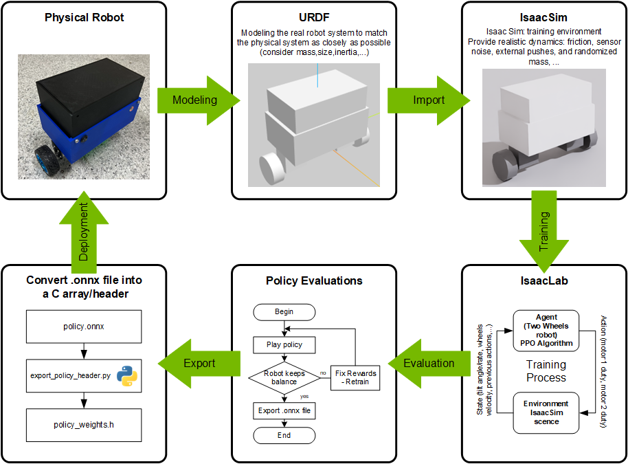
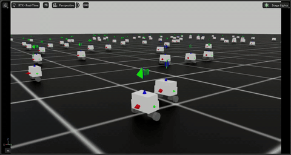
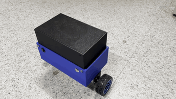
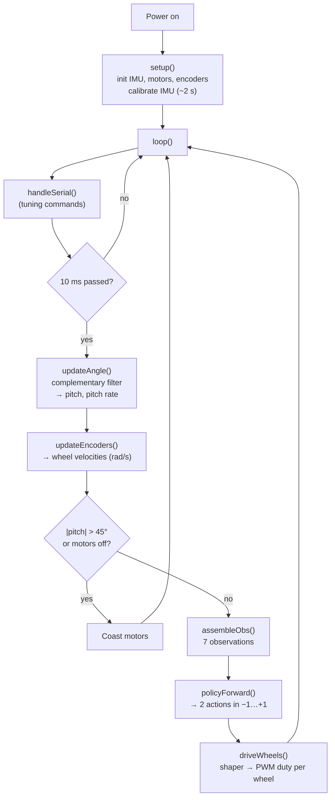

# Self-Balancing TWIP Robot (Isaac Lab)
# Training Self-Balance Robot on Isaac Sim/Issac Lab
## Overview

This project trains a two-wheeled self-balancing robot (a "TWIP" — two-wheeled inverted pendulum)
with reinforcement learning in Isaac Lab, then deploys the trained policy to real hardware.

The end-to-end workflow is:



- The robot is described by `assets/RobotTwoWheel/urdf/SelfBalancingRobot_simplified.urdf`
  (box/cylinder primitives with per-part masses and analytic inertias), imported directly into Isaac
  Sim at simulation start (no prebaked USD), so the simulated robot never drifts out of sync with it.
- Training uses Isaac Lab's manager-based RL environment (`source/SelfBalancing/`) with RSL-RL/PPO:
  the robot balances upright while tracking a randomly commanded forward/backward body velocity.
- `scripts/rsl_rl/play.py` evaluates a trained checkpoint and automatically exports it to both
  `policy.pt` (JIT) and `policy.onnx` under `logs/rsl_rl/<experiment>/<run>/exported/`.
- `tools/export_policy_header.py` converts that `.onnx` file into a C header, which the ESP32
  firmware in [`firmware/`](firmware/) compiles in and runs at 100 Hz (see
  [§6 Sim-to-real](#6-sim-to-real-deploy-the-policy-on-the-robot)).

### Demo

| Simulation (Isaac Sim, trained policy) | Real robot (ESP32) |
|---|---|
| [](docs/media/RL_SBR.webm) | [](docs/media/Real_SBR.mp4) |

*Click a preview to open the full-quality video.*

### Policy input/output

The policy is a small MLP (`actor_hidden_dims=[32, 32]` in `agents/rsl_rl_ppo_cfg.py`, no
observation normalization) that maps 7 observations straight to 2 wheel torques:

```text
[pitch angle, pitch rate, wheel_L velocity, wheel_R velocity, last action_L, last action_R,
 target velocity] -> MLP 7 -> 32 -> 32 -> 2 -> [wheel_L torque, wheel_R torque]
```

Observations are concatenated in exactly this order (`ObservationsCfg.PolicyCfg` in
`selfbalancing_env_cfg.py`). Gaussian noise is added during training only; play/evaluation runs
without it.

| # | Observation (input) | Source | Unit | Training noise (std) |
|---|---|---|---|---|
| 1 | pitch angle | `mdp.imu_pitch_angle` | rad | 0.02 |
| 2 | pitch rate | `mdp.imu_pitch_rate` | rad/s | 0.04 |
| 3 | wheel_L angular velocity | `mdp.joint_vel` (`wheel1_motor1_joint`) | rad/s | 0.05 |
| 4 | wheel_R angular velocity | `mdp.joint_vel` (`wheel2_motor2_joint`) | rad/s | 0.05 |
| 5 | previous action, wheel_L | `mdp.last_action_index` (`index=0`) | raw, `[-1, 1]` | — |
| 6 | previous action, wheel_R | `mdp.last_action_index` (`index=1`) | raw, `[-1, 1]` | — |
| 7 | target body velocity | `mdp.generated_commands` (`target_velocity`) | m/s | — |

- **Previous action (5–6):** the wheel actuator delays each command by 2–8 physics steps (10–40 ms,
  `DelayedPDActuatorCfg` in `robot.py`) to model the motor driver's reversal lag, so the torque
  applied now is a command from a few steps ago. Seeing its own last command lets the policy account
  for that. These are the *raw* policy outputs from the previous control step, before any scaling.
- **Target velocity (7):** a curriculum widens its range from 0 to ±0.5 m/s and shortens how often it
  changes from every 20 s to every 5 s over the first 20000 env steps (~625 iterations). Play uses
  the final values directly.
- **Sign convention:** positive wheel velocity/torque drives the robot forward (+X). Tilting toward
  +X gives a *negative* pitch angle. The pitch rate is `root_ang_vel_b[:, 1]`, which is the
  **negative** of d(pitch angle)/dt (measured with `scripts/pid_balance.py`). Firmware that computes
  the rate as +d(pitch)/dt must flip its sign before feeding it to the policy.

| # | Action (output) | Range | Unit |
|---|---|---|---|
| 1 | wheel_L torque command | raw `[-1, 1]` scaled by `MOTOR_TORQUE_MAX` | Nm, `[-0.49, 0.49]` |
| 2 | wheel_R torque command | raw `[-1, 1]` scaled by `MOTOR_TORQUE_MAX` | Nm, `[-0.49, 0.49]` |

The exported `policy.onnx`/`policy.pt` (see [Evaluate a trained policy and export
it](#evaluate-a-trained-policy-and-export-it)) keeps this exact 7-in/2-out contract — the ESP32
firmware needs to feed it observations in this order, units and sign convention, and apply the same
`[-1, 1] -> torque` scaling to its raw output.

**Keywords:** self-balancing robot, TWIP, reinforcement learning, Isaac Lab, RSL-RL, PPO, sim-to-real, ESP32

## 1. What is included

| Path                                                             | Purpose                                                      |
| ----------------------------------------------------------------- | ------------------------------------------------------------ |
| `assets/RobotTwoWheel/`                                          | Robot URDFs: `SelfBalancingRobot_simplified.urdf` (used for training) and the older STL-mesh `RobotTwoWheel.urdf` |
| `source/SelfBalancing/SelfBalancing/tasks/manager_based/selfbalancing/` | Robot config, MDP terms (actions/commands/events/observations/rewards/terminations), env config |
| `source/SelfBalancing/SelfBalancing/tasks/manager_based/selfbalancing/agents/` | RSL-RL PPO hyperparameters                                     |
| `scripts/rsl_rl/train.py`, `scripts/rsl_rl/play.py`               | Train / evaluate + export (.pt and .onnx) programs             |
| `scripts/list_envs.py`, `scripts/zero_agent.py`, `scripts/random_agent.py` | Sanity-check scripts (list registered tasks, zero/random action rollouts) |
| `scripts/pid_balance.py`                                          | Runs the firmware PID controller in Isaac Sim as a baseline / sim sanity check |
| `tools/export_policy_header.py`                                   | Converts an exported `policy.onnx` into `policy_weights.h` for the firmware (`--verify` checks it against ONNX Runtime) |
| `firmware/policy_controller/`                                     | ESP32 PlatformIO project that runs the trained policy on the real robot |
| `firmware/pid_controller/`                                        | ESP32 PlatformIO project with a classic PID balance controller (baseline) |
| `logs/rsl_rl/selfbalancing/<timestamp>/`                          | Per-run checkpoints, TensorBoard logs, and `exported/policy.onnx` |

## 2. Requirements

This guide covers Ubuntu only (22.04 LTS or 24.04 LTS).

- an NVIDIA RTX GPU with a recent driver (this project was developed and tested with the setup
  below); NVIDIA publishes the current GPU/VRAM/driver requirements for your Isaac Sim version in the
  [Isaac Sim requirements docs](https://docs.isaacsim.omniverse.nvidia.com/latest/installation/requirements.html) —
  run `nvidia-smi` first and repair the NVIDIA driver before installing anything if it fails;
- a stable internet connection for the first Isaac Sim launch (extension/shader downloads).

Tested with:

| Component | Version |
|---|---:|
| OS | Ubuntu 24.04 LTS |
| GPU / driver | NVIDIA RTX 3080 (10 GB VRAM) / 580.173.02 |
| Python | 3.11 |
| Isaac Sim | 5.1.0 |
| Isaac Lab | v2.3.2 |
| PyTorch | 2.7.0, CUDA 12.8 build |
| RSL-RL | 3.1.2 |
| NumPy | 1.26.0 |
| ONNX | 1.20.1 |

These are the versions this repository was validated against, not a hard requirement — but a
different `rsl-rl-lib`/Isaac Lab combination can change the RL config API (see Troubleshooting).

## 3. Install on Ubuntu 22.04 or 24.04

Every command block below can be copied and pasted into a terminal (`Ctrl + Alt + T`) as is.

### 3.1 Install system packages and Miniconda

```bash
sudo apt update
sudo apt install -y git curl wget cmake build-essential python3-venv
```

Skip the next block if `conda --version` already works.

```bash
mkdir -p ~/miniconda3
wget https://repo.anaconda.com/miniconda/Miniconda3-latest-Linux-x86_64.sh -O ~/miniconda3/miniconda.sh
bash ~/miniconda3/miniconda.sh -b -u -p ~/miniconda3
rm ~/miniconda3/miniconda.sh
~/miniconda3/bin/conda init bash
source ~/.bashrc
conda tos accept --override-channels --channel https://repo.anaconda.com/pkgs/main
conda tos accept --override-channels --channel https://repo.anaconda.com/pkgs/r
```

### 3.2 Create the Python environment

```bash
conda create -n env_isaaclab python=3.11 -y
conda activate env_isaaclab
python -m pip install --upgrade pip
```

The prompt must begin with `(env_isaaclab)` for every command below. In a new terminal, run
`conda activate env_isaaclab` first.

### 3.3 Install Isaac Sim and PyTorch

```bash
python -m pip install "isaacsim[all,extscache]==5.1.0" --extra-index-url https://pypi.nvidia.com
python -m pip install --upgrade --force-reinstall torch==2.7.0 torchvision==0.22.0 torchaudio==2.7.0 --index-url https://download.pytorch.org/whl/cu128
```

Start Isaac Sim once, accept the EULA, and let it finish downloading extensions/building shader
caches (can take more than ten minutes on the first launch), then close it:

```bash
isaacsim
```

### 3.4 Install Isaac Lab

```bash
cd ~
git clone https://github.com/isaac-sim/IsaacLab.git
cd IsaacLab
git checkout v2.3.2
./isaaclab.sh --install rsl_rl
```

### 3.5 Clone this repository

Clone it next to (not inside) the `IsaacLab` directory:

```bash
cd ~
git clone https://github.com/LilSun-11/RL_SelfBalancingRobot_Training.git
cd ~/RL_SelfBalancingRobot_Training
```

All commands in the rest of this guide are run from `~/RL_SelfBalancingRobot_Training` unless a
`cd` says otherwise.

### 3.6 Install this project

```bash
cd ~/RL_SelfBalancingRobot_Training
python -m pip install -e source/SelfBalancing
```

### 3.7 Install PlatformIO

[PlatformIO](https://platformio.org/) builds the ESP32 firmware and flashes it over USB (used in
[§6](#6-sim-to-real-deploy-the-policy-on-the-robot)). Its official installer puts it in its own
folder (`~/.platformio`), so it never touches the packages of `env_isaaclab`:

```bash
cd ~
curl -fsSL -o get-platformio.py https://raw.githubusercontent.com/platformio/platformio-core-installer/master/get-platformio.py
python3 get-platformio.py
rm get-platformio.py
echo 'export PATH="$PATH:$HOME/.platformio/penv/bin"' >> ~/.bashrc
source ~/.bashrc
conda activate env_isaaclab
pio --version
```

`pio --version` should print a version number. The ESP32 toolchain itself is downloaded
automatically the first time you build the firmware.

## 4. Verify the installation

List the registered tasks (`Template-SelfBalancing-v0` and `Template-SelfBalancing-Play-v0` should
appear — note the search pattern `"Template-"` in `scripts/list_envs.py`):

```bash
cd ~/RL_SelfBalancingRobot_Training
python scripts/list_envs.py
```

Run a zero-action or random-action rollout to confirm the environment itself is configured
correctly, before spending time on training:

```bash
python scripts/zero_agent.py --task=Template-SelfBalancing-v0
python scripts/random_agent.py --task=Template-SelfBalancing-v0
```

### Set up IDE (Optional)

- Run VSCode Tasks, by pressing `Ctrl+Shift+P`, selecting `Tasks: Run Task` and running the
  `setup_python_env` in the drop down menu. When running this task, you will be prompted to add the
  absolute path to your Isaac Sim installation.

If everything executes correctly, it should create a file `.python.env` in the `.vscode` directory,
containing the python paths to all the extensions provided by Isaac Sim and Omniverse — this helps
with indexing for intelligent code suggestions.

### Setup as Omniverse Extension (Optional)

An example UI extension loads upon enabling your extension, defined in
`source/SelfBalancing/SelfBalancing/ui_extension_example.py`.

1. **Add the search path of this project/repository** to the extension manager:
    - Navigate to the extension manager using `Window` -> `Extensions`.
    - Click on the **Hamburger Icon**, then go to `Settings`.
    - In the `Extension Search Paths`, enter the absolute path to the `source` directory of this project.
    - If not already present, also add the path to Isaac Lab's extension directory (`IsaacLab/source`).
    - Click on the **Hamburger Icon**, then click `Refresh`.

2. **Search and enable your extension**:
    - Find your extension under the `Third Party` category.
    - Toggle it to enable your extension.

## 5. Train and export your policy

Two task variants are registered: `Template-SelfBalancing-v0` (training, 8196 parallel envs) and
`Template-SelfBalancing-Play-v0` (playback/evaluation, 360 envs, no observation noise — see
`SelfBalancingEnvCfg_PLAY` in `selfbalancing_env_cfg.py`). The robot's task is to stay upright while
tracking a randomly commanded forward/backward body velocity (curriculum up to -0.5 to 0.5 m/s, see
[Policy input/output](#policy-inputoutput)).

### Train

```bash
python scripts/rsl_rl/train.py --task=Template-SelfBalancing-v0 --headless
```

Drop `--headless` to watch training in the viewport (much slower). Useful flags:

- `--num_envs <N>` — override the number of parallel environments.
- `--max_iterations <N>` — number of PPO iterations to run.
- `--seed <N>` — environment seed.

Logs and checkpoints are saved under `logs/rsl_rl/<experiment_name>/<timestamp>/` (`experiment_name`
is set in `agents/rsl_rl_ppo_cfg.py`).

### Resume training

```bash
python scripts/rsl_rl/train.py --task=Template-SelfBalancing-v0 --headless \
    --resume --load_run <run_dir_name> --checkpoint <model_XXX.pt> --max_iterations <N>
```

`--max_iterations` adds `<N>` more iterations on top of the resumed checkpoint, not a total target.
Omit `--load_run`/`--checkpoint` to auto-pick the most recent run and its latest checkpoint.
Resuming only works if the observation/action dimensions haven't changed since that checkpoint was
trained (other config changes, e.g. reward weights, are fine to resume across).

### Evaluate a trained policy and export it

```bash
python scripts/rsl_rl/play.py --task=Template-SelfBalancing-Play-v0 \
    --load_run <run_dir_name> --checkpoint <model_XXX.pt>
```

This both plays the policy in the viewport (add `--real-time` to pace it to real time, or `--video`
to record instead of watching live) and exports it, writing `policy.pt` (JIT) and `policy.onnx` to
`logs/rsl_rl/selfbalancing/<run_dir_name>/exported/`. `policy.onnx` is the file
[§6.3](#63-convert-the-onnx-policy-into-a-c-header) converts into a C header for the ESP32.

To compare runs (reward curves, episode length, termination breakdown, etc.) before picking a
checkpoint to evaluate, point TensorBoard at the project's log directory:

```bash
tensorboard --logdir logs/rsl_rl/selfbalancing --port 6006
```

Then open `http://localhost:6006` in a browser. `--logdir` can also point at a single run
(`logs/rsl_rl/selfbalancing/<run_dir_name>`) to inspect just that run, and `--port` can be omitted to
use TensorBoard's default port (6006).

## 6. Sim-to-real: deploy the policy on the robot

The trained network is only weights, biases and a few activations, so instead of running an AI
runtime on the microcontroller, `tools/export_policy_header.py` turns `policy.onnx` into plain C
arrays and the firmware evaluates the MLP in C++ at 100 Hz (tens of µs per step).

```text
policy.onnx ──(tools/export_policy_header.py)──► firmware/policy_controller/include/policy_weights.h
                                                          │
                                       pio run -t upload  ▼
                          ESP32: read IMU + encoders → MLP → PWM to both motors (100 Hz)
```

The parts of the repository used here:

```text
RL_SelfBalancingRobot_Training/
├── tools/
│   ├── export_policy_header.py     ← converter: policy.onnx → policy_weights.h (--verify checks it)
│   └── requirements.txt
├── firmware/
│   ├── README.md                   ← firmware reference: pins, motor shaping, serial commands
│   ├── policy_controller/          ← PlatformIO project that runs the RL policy
│   │   ├── include/
│   │   │   └── policy_weights.h    ← generated header (overwritten by §6.3)
│   │   ├── src/
│   │   │   └── main.cpp            ← read sensors → build observations → MLP → drive motors
│   │   └── platformio.ini          ← board esp32dev, ESP32Encoder library, 921600 baud
│   └── pid_controller/             ← same hardware with a classic PID (baseline, 115200 baud)
│       ├── src/
│       │   └── main.cpp
│       └── platformio.ini
└── logs/rsl_rl/selfbalancing/<run_dir_name>/exported/policy.onnx   ← from §5
```

### 6.1 Prepare the PC

**Allow Linux to access the USB board (required, do once).** By default Linux blocks normal users
from serial ports; without this, upload fails with *"Permission denied: /dev/ttyUSB0"*.

```bash
# 1. Install PlatformIO's udev rules
curl -fsSL https://raw.githubusercontent.com/platformio/platformio-core/develop/platformio/assets/system/99-platformio-udev.rules \
  | sudo tee /etc/udev/rules.d/99-platformio-udev.rules
sudo udevadm control --reload-rules
sudo udevadm trigger

# 2. Add your user to the serial-port groups
sudo usermod -a -G dialout,plugdev $USER

# 3. Ubuntu's braille driver grabs CH340 USB-serial chips (used on many ESP32 boards); remove it
sudo apt remove -y brltty
```

Then **log out and log back in** (or reboot) so the group change takes effect, and verify:

```bash
groups               # the list should include "dialout"
```

**Install the converter's packages** into `env_isaaclab` (Isaac Lab usually installs them already;
running it again is harmless):

```bash
conda activate env_isaaclab
pip install numpy onnx
pip install onnxruntime        # only needed for the --verify check in §6.3
```

### 6.2 Hardware: components & wiring

This matches the firmware in [`firmware/`](firmware/) (pins are defined at the top of each
`src/main.cpp`).

#### 6.2.1 Bill of materials

| # | Component | Qty | Function |
|---|---|:-:|---|
| 1 | **JGB37-520** 12 V DC gear motor with encoder (11 PPR, 30:1) | 2 | Drives the wheels and reports wheel speed |
| 2 | **L298N** (or similar) dual H-bridge motor driver | 1 | Lets the MCU control motor speed and direction |
| 3 | **18650 Li-ion** battery (3.7 V) | 3 | In series (3S) = 11.1–12.6 V main power |
| 4 | **LSM6DS3** IMU (6-axis, I²C address 0x6B or 0x6A) | 1 | Measures tilt angle and tilt rate |
| 5 | **ESP32 DevKit** (ESP32-WROOM-32, `board = esp32dev`) | 1 | Reads sensors, runs the policy |
| 6 | **12 V → 5 V buck converter** | 1 | Powers the ESP32 from the battery |
| 7 | Addressable RGB LED (WS2812) | 1 | Status: green = running, dim red = motors off, bright red = fallen |
| – | Chassis, 65 mm wheels, jumper wires | – | Mechanical assembly |

#### 6.2.2 Pin connection table

| Module | Pin(s) | ESP32 GPIO | Purpose |
|---|---|---|---|
| LSM6DS3 | SDA / SCL | **GPIO21 / GPIO22** | I²C data / clock |
| LSM6DS3 | VCC, GND | 3V3, GND | Sensor power |
| L298N | ENA / IN1 / IN2 | **GPIO15 / GPIO2 / GPIO4** | Left motor speed (PWM) / direction |
| L298N | ENB / IN3 / IN4 | **GPIO5 / GPIO19 / GPIO18** | Right motor speed (PWM) / direction |
| Left encoder | A / B | **GPIO14 / GPIO26** | Left wheel feedback |
| Right encoder | A / B | **GPIO33 / GPIO32** | Right wheel feedback |
| RGB LED | DIN | **GPIO27** | Status LED |

Motor outputs: **L298N OUT1/OUT2 → left motor**, **OUT3/OUT4 → right motor**. "Left" is the wheel
on the robot's left when it faces forward (`wheel1` / `+Y` in the simulation).

#### 6.2.3 Motor cable (6 wires, JGB37-520)

| Label | Connect to | Meaning |
|---|---|---|
| M1 | L298N OUT | Motor power |
| GND | GND | Encoder ground |
| C2 | ESP32 GPIO | Encoder channel A |
| C1 | ESP32 GPIO | Encoder channel B |
| VCC | ESP32 **3V3** | Encoder power |
| M2 | L298N OUT | Motor power |

#### 6.2.4 Power wiring

```text
3S battery (+12 V) ──┬──► L298N "12V" terminal ──► motors
                     └──► Buck converter IN ──► 5 V OUT ──► ESP32 DevKit "5V"/"VIN" pin
ESP32 "3V3" pin ──► LSM6DS3 and both encoders
GND: battery, L298N, buck converter, ESP32, LSM6DS3, encoders ── ALL connected together
```

> ⚠️ **Read before powering on**
> 1. **All grounds must be connected together.** This is the #1 cause of strange behavior.
> 2. ESP32 pins are **3.3 V only**. Power the encoders from **3V3**, never 5 V.
> 3. Remove the **ENA/ENB jumpers** on the L298N, otherwise the ESP32 cannot control motor speed.
> 4. Do **not** connect USB and the battery for the first time without checking polarity with a multimeter.
> 5. Mount the IMU firmly near the wheel axle; the firmware reads pitch from its X gyro axis and the
>    Y/Z accelerometer axes.

### 6.3 Convert the ONNX policy into a C header

```bash
cd ~/RL_SelfBalancingRobot_Training
conda activate env_isaaclab
python tools/export_policy_header.py \
    --model logs/rsl_rl/selfbalancing/<run_dir_name>/exported/policy.onnx \
    --out firmware/policy_controller/include/policy_weights.h --verify
```

Replace `<run_dir_name>` with the run you exported in [§5](#evaluate-a-trained-policy-and-export-it).

| Argument | Meaning |
|---|---|
| `--model` | The exported model to convert |
| `--out` | Header to write — directly into the firmware project, so no copy step is needed |
| `--verify` | Runs the same C-style calculation in NumPy and compares it with ONNX Runtime on random inputs; fails loudly on any mismatch |

**Supported models:** simple feed-forward networks (MLP), meaning layers connected in a straight chain:

- Linear layers (`Gemm`, or `MatMul` + `Add`)
- Activations `Elu`, `Relu`, `Tanh`, `Sigmoid` (`Clip(min=0)` is treated as `Relu`)
- Optional input normalization `(x − mean) / std`

> ⚠️ The firmware refuses to compile unless the header has `POLICY_OBS_DIM == 7` and
> `POLICY_ACT_DIM == 2` — the observation layout built in `assembleObs()` (see §6.5). If you change
> the observations in `selfbalancing_env_cfg.py`, update `assembleObs()` to match before flashing.

> 💡 Every time you retrain the policy, repeat §6.3 and §6.4.

### 6.4 Build & flash the firmware

Plug the ESP32 into the PC with a **data** USB cable (many cheap cables are charge-only). The board
shows up as `/dev/ttyUSB0` (check with `ls /dev/ttyUSB*`); PlatformIO picks the port automatically.

```bash
cd ~/RL_SelfBalancingRobot_Training/firmware/policy_controller
pio run                 # build (the first build downloads the ESP32 toolchain and libraries)
pio run -t upload       # build and flash
pio device monitor      # serial monitor at 921600 baud (from platformio.ini); Ctrl + C to exit
```

| Action | Command | Success looks like |
|---|---|---|
| Build | `pio run` | Green `[SUCCESS]` + RAM/Flash usage |
| Upload | `pio run -t upload` | `[SUCCESS]`, then the board restarts |
| Serial monitor | `pio device monitor` | `# CALIB ...`, `# READY MLP ...`, then one telemetry line per step |
| Upload + monitor | `pio run -t upload -t monitor` | Both of the above |

Notes:

- If several boards are plugged in, add `--upload-port /dev/ttyUSB0` (upload) or `--port /dev/ttyUSB0` (monitor).
- **Close the serial monitor before uploading**, or the port will be busy.
- On boot the firmware calibrates the IMU for ~2 s: **hold the robot upright and still** until it
  prints `# CALIB offset=...`.
- The PID baseline is built the same way from `firmware/pid_controller` (115200 baud). It is a
  useful first check that the hardware can balance at all before trying the policy.

### 6.5 Control program design

`firmware/policy_controller/src/main.cpp` runs this loop every 10 ms:


```mermaid
flowchart TD
    P[Power on] --> S["setup()<br/>init IMU, motors, encoders<br/>calibrate IMU (~2 s)"]
    S --> L["loop()"]
    L --> HS["handleSerial()<br/>(tuning commands)"]
    HS --> T{"10 ms passed?"}
    T -- no --> L
    T -- yes --> R["updateAngle()<br/>complementary filter<br/>→ pitch, pitch rate"]
    R --> E["updateEncoders()<br/>→ wheel velocities (rad/s)"]
    E --> SF{"|pitch| > 45°<br/>or motors off?"}
    SF -- yes --> STOP["Coast motors"] --> L
    SF -- no --> O["assembleObs()<br/>7 observations"]
    O --> MLP["policyForward()<br/>→ 2 actions in −1…+1"]
    MLP --> D["driveWheels()<br/>shaper → PWM duty per wheel"] --> L
```

#### 6.5.1 Policy inputs and outputs

The observations must match the simulation exactly (see [Policy input/output](#policy-inputoutput)):

| # | Observation | Firmware source | Unit |
|---|---|---|---|
| 1 | pitch angle | complementary filter, minus the pitch trim (`s` command) | rad |
| 2 | pitch rate | `-rateDps` (gyro X, sign flipped to match the sim) | rad/s |
| 3 | left wheel velocity | left encoder | rad/s |
| 4 | right wheel velocity | right encoder | rad/s |
| 5 | previous action, left | policy output of the previous step | `[-1, 1]` |
| 6 | previous action, right | policy output of the previous step | `[-1, 1]` |
| 7 | target velocity | `VEL_CMD_MPS` (0 = balance in place) | m/s |

The 2 outputs (left, right) are numbers in **−1 … +1** that `driveWheels()` turns into a PWM duty
(20 kHz, 10-bit) per motor: sign = direction, size = strength.

> ⚠️ **The most common reason a sim-trained policy fails on the real robot:** the inputs do not
> match the simulation. Check the **order**, **units** (rad, rad/s, m/s), **signs** (which direction
> is positive) and **scaling** of all 7 inputs against Isaac Lab.

#### 6.5.2 Estimating the tilt angle (complementary filter)

Neither sensor alone is good enough:

| Sensor | Good at | Bad at |
|---|---|---|
| Accelerometer | Correct angle over long time | Very noisy when the robot moves |
| Gyroscope | Smooth, fast response | Slowly drifts away from the true angle |

The complementary filter combines both, trusting the gyro for fast changes and the accelerometer to correct long-term drift:

$$
\theta_{filtered} = \alpha \cdot \left(\theta_{filtered} + \dot{\theta}\,\Delta t\right) + (1-\alpha)\cdot\theta_{acc}
$$

- `α = 0.98` (`COMP_ALPHA`): 98 % gyro, 2 % accelerometer per step
- `Δt = 0.01 s` (100 Hz)

#### 6.5.3 Wheel velocity from the encoders

- The `ESP32Encoder` library counts encoder pulses with the ESP32's hardware counter (full
  quadrature), so no pulses are missed.
- One wheel revolution = 11 PPR × 30:1 gearbox × 4 = **1320 counts** (`ENC_TICKS_PER_REV`).
- Wheel velocity (rad/s) = Δcounts × 2π / 1320 / Δt — the same unit as the simulation's joint velocity.

#### 6.5.4 Motor output shaping, safety and serial commands

- The motors are cut (coast) when the tilt exceeds **45°**, and the loop never uses `delay()`.
- `driveWheels()` adds a deadband, a minimum duty to get past motor stiction and a duty cap near
  balance — see [Motor output shaping](firmware/README.md#motor-output-shaping).
- Parameters can be changed live over the serial monitor (one command per line, `?` lists them),
  e.g. `x` / `o` motors off / on, `t` motor test, `c` re-calibrate, `s<deg>` pitch trim — full list
  in [Serial commands](firmware/README.md#serial-commands).

### 6.6 Recommended testing order

Test one part at a time; it is much easier to find problems this way. The motors are **on** after
boot, so send `x` first while you check the sensors.

1. **IMU:** tilt the robot by hand and watch `pitch` / `rate` in the telemetry: ~0° upright, and both
   must move in the same direction (fix with `g-1` or `i-1`).
2. **Encoders:** roll each wheel forward by hand: `velL` / `velR` must be positive (fix with `e-1` / `r-1`).
3. **Motors:** with the **wheels off the ground**, send `t`: both wheels must spin forward, then
   backward (swap that motor's wires or use `m-1`).
4. **Safety:** send `o`, tilt past 45° and confirm the motors stop (LED bright red).
5. **Full policy:** hold the robot upright, send `o`, let go gently and keep a hand ready to catch it.

### 6.7 Troubleshooting (hardware)

| Problem | Likely cause & fix |
|---|---|
| `Permission denied: /dev/ttyUSB0` | Do §6.1 (udev rules + `dialout` group), then log out and back in |
| No `/dev/ttyUSB*` appears | Charge-only cable → use a data cable. Board uses a CH340 chip → `sudo apt remove brltty` (§6.1) and replug |
| `pio: command not found` | Run `source ~/.bashrc` or redo §3.7 |
| Port busy / upload fails | Close the serial monitor (`Ctrl + C`) and any other program using the port |
| Upload stuck at `Connecting...` | Hold the **BOOT** button on the board until the upload starts |
| Garbled text in serial monitor | Baud rate mismatch: open it with `pio device monitor` from the project folder (921600 policy / 115200 PID) |
| Firmware does not compile: `POLICY_OBS_DIM` | The policy's observation count differs from `assembleObs()` (§6.3) |
| `ModuleNotFoundError: onnx` | `conda activate env_isaaclab`, then `pip install numpy onnx` |
| `--verify` fails | The model is not a simple MLP or uses unsupported layers; re-export from Isaac Lab |
| A wheel spins the wrong way | Swap that motor's two wires on the L298N (or `m-1` for both) |
| Robot falls immediately | Check input order, units and signs (§6.5.1); check the IMU axis and sign |
| Sensor values jump when motors run | Missing common ground, loose wires, or low battery |
| Board resets when the motors start | Brown-out: check the 5 V supply and the common ground |

### 6.8 Quick start checklist

- [ ] PlatformIO installed, `pio --version` works (§3.7)
- [ ] USB permissions set up, `groups` shows `dialout` (§6.1)
- [ ] Robot wired as in §6.2, **all grounds connected**
- [ ] `policy_weights.h` generated with `--verify` passing (§6.3)
- [ ] Firmware built and flashed, `# READY MLP ...` printed (§6.4)
- [ ] IMU, encoders, motors and safety stop tested one by one (§6.6)
- [ ] Robot placed upright and balancing 🎉

## 7. Troubleshooting

| Symptom | Cause and fix |
|---|---|
| `python` points outside `env_isaaclab`, or `isaacsim`/`isaaclab.sh` not found | Run `conda activate env_isaaclab` and retry |
| `ModuleNotFoundError: isaaclab` or `isaaclab_rl` | Isaac Lab isn't installed in this environment — rerun `./isaaclab.sh --install rsl_rl` from the `IsaacLab` directory |
| `torch.cuda.is_available()` is `False` | Repair the NVIDIA driver, then reinstall the cu128 PyTorch command from step 3.3 |
| `RslRlOnPolicyRunnerCfg`/checkpoint errors mentioning `actor`/`critic`/`policy` fields | A newer `rsl-rl-lib` restructured the RL config; `train.py`/`play.py` already call `handle_deprecated_rsl_rl_cfg`/`handle_deprecated_rsl_rl_checkpoint` when available to bridge this — make sure Isaac Lab is up to date, or pin `rsl-rl-lib` to the tested version (3.1.2) |
| Task not listed by `scripts/list_envs.py` | Confirm the package was installed with `python -m pip install -e source/SelfBalancing` and that the task id still starts with `Template-` (see `scripts/list_envs.py`'s search pattern) |
| First Isaac Sim launch appears frozen | Wait — the first launch downloads extensions/builds shader caches, which can take more than ten minutes |
| Pylance is missing indexing for part of the extensions | Add the path to your extension in `.vscode/settings.json` under `"python.analysis.extraPaths"` (see below) |
| Pylance crashes / runs out of memory | Too many files are indexed — comment out unused Omniverse packages under `"python.analysis.extraPaths"` in `.vscode/settings.json` (see below) |

Hardware and flashing problems are covered in [§6.7](#67-troubleshooting-hardware).

### Pylance Missing Indexing of Extensions

In some VsCode versions, the indexing of part of the extensions is missing.
In this case, add the path to your extension in `.vscode/settings.json` under the key `"python.analysis.extraPaths"`.

```json
{
    "python.analysis.extraPaths": [
        "<path-to-ext-repo>/source/SelfBalancing"
    ]
}
```

### Pylance Crash

If you encounter a crash in `pylance`, it is probable that too many files are indexed and you run out of memory.
A possible solution is to exclude some of omniverse packages that are not used in your project.
To do so, modify `.vscode/settings.json` and comment out packages under the key `"python.analysis.extraPaths"`
Some examples of packages that can likely be excluded are:

```json
"<path-to-isaac-sim>/extscache/omni.anim.*"         // Animation packages
"<path-to-isaac-sim>/extscache/omni.kit.*"          // Kit UI tools
"<path-to-isaac-sim>/extscache/omni.graph.*"        // Graph UI tools
"<path-to-isaac-sim>/extscache/omni.services.*"     // Services tools
...
```

## Code formatting

We have a pre-commit template to automatically format your code.
To install pre-commit:

```bash
pip install pre-commit
```

Then you can run pre-commit with:

```bash
pre-commit run --all-files
```

## 🙏 Acknowledgements

Physical Artificial Intelligence Lab, **University of Ulsan**. Sim To Real Course, Hardware Team.
Supervisor: Prof. **Ahn Kyoung Kwan**.
