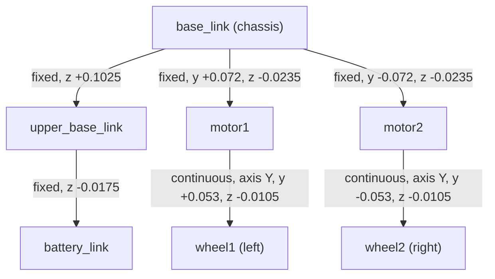

# 3. Build the Robot URDF

A simulator can only train a controller for the robot it is given. In this chapter you describe the
real robot in a **URDF** (Unified Robot Description Format) file: what its parts are, how they are
connected, and how heavy they are. The better this file matches the real robot, the better the
trained policy will transfer.

!!! abstract "Learning objectives"
    - Understand links, joints and frames in a URDF.
    - Model each part with a simple shape and compute its inertia.
    - Place the joints so the wheels touch the ground at the right height.

You will create **one new file** in your project:

```text
~/SelfBalancing/assets/RobotTwoWheel/urdf/SelfBalancingRobot_simplified.urdf   NEW
```

The sections below explain each part of it; [3.7](#37-create-the-file) gives the complete file.

## 3.1 URDF in one minute

A URDF is an XML file with two kinds of elements:

- A **link** is a rigid part. It has an `<inertial>` (mass, center of mass, inertia tensor), a
  `<visual>` (what you see) and a `<collision>` (what touches other things).
- A **joint** connects a parent link to a child link. Its `<origin>` places the child frame relative
  to the parent frame, and its `type` says how the child can move: `fixed` (welded),
  `continuous` (rotates forever, like a wheel), `revolute` (rotates within limits), and so on.

The links form a tree with one root. For this robot the root is `base_link`, the chassis.

**Frame convention used everywhere in this project:** X points forward, Y points to the robot's
left, Z points up. Distances are in meters, masses in kilograms, angles in radians.

## 3.2 Measure the real robot

Before writing anything, measure:

1. **Mass of each part** with a kitchen scale: chassis plate, upper plate, battery pack, each motor,
   each wheel. Small items (screws, wires, the ESP32) can be added to the part they sit on.
2. **Size of each part** (a bounding box is enough for a box-shaped part, radius and width for a
   wheel).
3. **Position of each part** relative to the chassis: how high the upper plate is, how far apart the
   wheels are, how far the wheel axle is below the chassis.

For this robot:

| Part | Link | Shape | Size (m) | Mass (kg) |
|---|---|---|---|---|
| Lower chassis | `base_link` | box | 0.120 × 0.200 × 0.075 | 0.300 |
| Upper plate | `upper_base_link` | box | 0.113 × 0.185 × 0.055 | 0.235 |
| Battery pack | `battery_link` | box | 0.081 × 0.076 × 0.020 | 0.215 |
| Motor (×2) | `motor1`, `motor2` | box | 0.040 × 0.056 × 0.047 | 0.170 each |
| Wheel (×2) | `wheel1`, `wheel2` | cylinder | r = 0.034, width = 0.026 | 0.035 each |

Total: about 1.16 kg.

!!! tip "Why boxes and cylinders instead of the CAD meshes?"
    A URDF can also be exported from CAD (e.g. the SolidWorks URDF exporter), with the real part
    shapes as STL meshes. The simplified model is used for training because every mass and inertia is written by hand from
    real measurements (CAD exports often get these wrong, for example when parts have no material
    assigned), and primitive shapes make collision checking cheaper and more stable. For balancing,
    what matters is the mass distribution, not how the robot looks.

## 3.3 Compute the inertia of each part

The inertia tensor describes how hard it is to rotate a part about each axis. For a uniform solid
part, about its own center:

=== "Box (size x × y × z)"

    $$
    I_{xx} = \tfrac{m}{12}(y^2 + z^2), \quad
    I_{yy} = \tfrac{m}{12}(x^2 + z^2), \quad
    I_{zz} = \tfrac{m}{12}(x^2 + y^2)
    $$

=== "Cylinder (radius r, length h, axis along z)"

    $$
    I_{xx} = I_{yy} = \tfrac{m}{12}(3r^2 + h^2), \quad
    I_{zz} = \tfrac{m}{2} r^2
    $$

A small script avoids arithmetic mistakes:

```python
def box(m, x, y, z):
    return dict(ixx=m / 12 * (y**2 + z**2), iyy=m / 12 * (x**2 + z**2), izz=m / 12 * (x**2 + y**2))

def cylinder(m, r, h):
    side = m / 12 * (3 * r**2 + h**2)
    return dict(ixx=side, iyy=side, izz=m / 2 * r**2)

print("base_link", box(0.300, 0.120, 0.200, 0.075))   # ixx=1.1406e-03, iyy=5.0063e-04, izz=1.36e-03
print("wheel    ", cylinder(0.035, 0.034, 0.026))      # ixx=iyy=1.2087e-05, izz=2.023e-05
```

The off-diagonal terms (`ixy`, `ixz`, `iyz`) are 0 for a box or cylinder aligned with its frame.

## 3.4 Write the links

Each link puts its `<inertial>`, `<visual>` and `<collision>` at the part's center. Here is
`base_link`; its center is 0.0375 m (half its height) above the link frame, so the frame sits at the
bottom of the chassis:

```xml
<link name="base_link">
  <inertial>
    <origin xyz="0 0 0.0375" rpy="0 0 0" />
    <mass value="0.3" />
    <inertia ixx="1.140625E-03" ixy="0.0" ixz="0.0"
             iyy="5.0063E-04" iyz="0.0" izz="1.36E-03" />
  </inertial>
  <visual>
    <origin xyz="0 0 0.0375" rpy="0 0 0" />
    <geometry><box size="0.120 0.2 0.075" /></geometry>
  </visual>
  <collision>
    <origin xyz="0 0 0.0375" rpy="0 0 0" />
    <geometry><box size="0.120 0.2 0.075" /></geometry>
  </collision>
</link>
```

A URDF cylinder's axis is its local Z. A wheel must spin about Y, so the wheel's geometry is rotated
by 90° about X (`rpy="1.5707 0 0"`):

```xml
<link name="wheel1">
  <inertial>
    <origin xyz="0 0 0" rpy="1.5707 0 0" />
    <mass value="0.035" />
    <inertia ixx="1.2087E-05" ixy="0.0" ixz="0.0" iyy="1.2087E-05" iyz="0.0" izz="2.023E-05" />
  </inertial>
  <visual>
    <origin xyz="0 0 0" rpy="1.5707 0 0" />
    <geometry><cylinder radius="0.034" length="0.026" /></geometry>
  </visual>
  <collision>
    <origin xyz="0 0 0" rpy="1.5707 0 0" />
    <geometry><cylinder radius="0.034" length="0.026" /></geometry>
  </collision>
</link>
```

## 3.5 Connect the links with joints



Everything except the wheels is `fixed`: Isaac Lab later merges those links into `base_link`, so
they only contribute mass and inertia. The two wheel joints are `continuous` and rotate about Y:

```xml
<joint name="wheel1_motor1_joint" type="continuous">
  <parent link="motor1" />
  <child link="wheel1" />
  <origin xyz="0 0.053 -0.0105" rpy="0 0 0" />
  <axis xyz="0 1 0" />
</joint>
```

`wheel1` is at +Y, so it is the **left** wheel; `wheel2` (at −Y) is the right wheel. With
`axis="0 1 0"`, a positive wheel velocity rolls the robot forward (+X). Keep these two facts in mind:
the firmware in chapter 8 must use the same left/right order and the same sign.

## 3.6 Check the ground clearance

Add up the vertical offsets from `base_link` down to the bottom of a wheel:

| Step | Offset (m) |
|---|---|
| `base_link` → motor | −0.0235 |
| motor → wheel center | −0.0105 |
| wheel center → bottom of wheel (radius) | −0.0340 |
| **Total** | **−0.0680** |

So when the wheels rest on the ground, `base_link` is 0.068 m above it. Chapter 4 spawns the robot at
0.070 m, a 2 mm margin so the wheels drop onto the ground instead of starting inside it.

## 3.7 Create the file

Create the folder and the file:

```bash
cd ~/SelfBalancing
mkdir -p assets/RobotTwoWheel/urdf
gedit assets/RobotTwoWheel/urdf/SelfBalancingRobot_simplified.urdf   # or any editor, e.g. code, nano
```

Paste the complete URDF and save:

??? example "`assets/RobotTwoWheel/urdf/SelfBalancingRobot_simplified.urdf` (complete file)"

    ```xml
    --8<-- "docs/code/assets/RobotTwoWheel/urdf/SelfBalancingRobot_simplified.urdf"
    ```

[:material-download: Download the file](code/assets/RobotTwoWheel/urdf/SelfBalancingRobot_simplified.urdf){ .md-button download }

!!! tip "Building your own robot?"
    Keep the structure (root `base_link`, fixed links merged into it, two `continuous` wheel joints
    about Y, left wheel at +Y) and replace the sizes, masses, inertias and joint offsets with your
    own measurements.

!!! success "Checkpoint"
    You have a URDF whose masses add up to the real robot's weight, with the left wheel at +Y, both
    wheel joints rotating about Y, and a known ground clearance.
