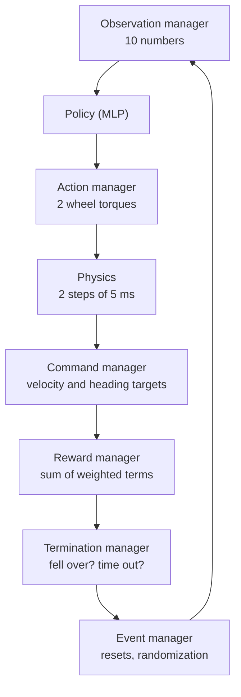

# 5. Create the RL Task

The robot can now be simulated. To train a controller you also need a **task**: what the policy
observes, what it controls, what it is asked to do, how it is rewarded, and when an attempt ends.
In this chapter you replace the generated cart-pole task with the self-balancing robot.

!!! abstract "Learning objectives"
    - Understand the parts of a manager-based environment.
    - Write custom observation, command, event, reward and curriculum terms.
    - Assemble them in the environment config and register the task.
    - Choose observations that the real robot can also measure.

All files in this chapter are in the **task folder**. Open a terminal there:

```bash
cd ~/SelfBalancing/source/SelfBalancing/SelfBalancing/tasks/manager_based/selfbalancing
```

## 5.1 How a manager-based environment works

A manager-based environment is described by one config class that lists **terms**, grouped by
manager. Each term is a small function (or class) plus its parameters. Isaac Lab's managers call the
terms at the right moment of every step:



Isaac Lab already provides many terms (`isaaclab.envs.mdp`). The ones specific to this robot go in
the `mdp/` sub-package, one file per kind of term. You will write them first (5.2–5.7), then use
them in the config (5.8).

## 5.2 `mdp/__init__.py` — replace

The generated file only exports `rewards.py`. Replace its content so that `mdp.<name>` gives access
to Isaac Lab's built-in terms **and** all the files you are about to create:

```python title="mdp/__init__.py"
--8<-- "docs/code/source/SelfBalancing/SelfBalancing/tasks/manager_based/selfbalancing/mdp/__init__.py"
```

## 5.3 `mdp/observations.py` — new

!!! tip "Rule: only observe what the real robot can measure"
    The simulator knows everything (exact position, true velocity, contact forces…). The real robot
    only has an IMU and two wheel encoders. Every observation here can be computed on the ESP32;
    that is what makes deployment possible.

| Function | Returns | On the real robot |
|---|---|---|
| `imu_pitch_angle` | tilt about the wheel axis, from the gravity direction in the body frame | IMU, complementary filter |
| `imu_pitch_rate` | angular velocity about body Y | gyro X |
| `imu_yaw_rate` | angular velocity about body Z, + = turning left | gyro Z |
| `relative_yaw` | yaw relative to the spawn heading, [−π, π] | gyro Z, integrated from 0 |
| `last_action_index` | previous action of one wheel | remembered by the firmware |

The wheel velocities need no custom function: Isaac Lab's `mdp.joint_vel` already returns them.

!!! warning "Sign conventions"
    Tilting toward +X (forward) gives a **negative** pitch angle, and `imu_pitch_rate` is the
    **negative** of d(pitch angle)/dt. This is just how the frames work out; it is fine for training,
    but the firmware in chapter 8 must reproduce exactly the same signs.

Create `mdp/observations.py`:

```python title="mdp/observations.py"
--8<-- "docs/code/source/SelfBalancing/SelfBalancing/tasks/manager_based/selfbalancing/mdp/observations.py"
```

## 5.4 `mdp/commands.py` — new

Commands are the goal given to the robot, changed during an episode so the policy learns to follow
changing instructions. A command term is a class with:

- `command` — the current target, read by observations and rewards;
- `_resample_command(env_ids)` — draws a new target when its timer runs out;
- `_update_command()` — runs every step (e.g. to hold a target at 0);
- `_update_metrics()` — values logged to TensorBoard;
- `_set_debug_vis_impl` / `_debug_vis_callback` — the arrows you see when playing.

This file defines two terms:

- **`UniformVelocityCommand`** — a forward/backward speed. With probability `rel_standing_envs` the
  target is exactly 0, so the policy also learns to stand still. Debug arrows: green = target,
  blue = actual velocity.
- **`UniformYawCommand`** — a heading relative to the direction the robot faced at spawn (yaw 0).
  Each new target is at most `max_step` away from the previous one. A robot told to stand still by
  the velocity command keeps the heading it has. Debug arrow: orange = target heading.

!!! question "Why a heading and not a turning speed?"
    A heading command also holds the robot pointing the same way: with a target yaw of 0, any drift
    is an error that the policy corrects. This is what keeps the real robot from slowly spinning when
    it should stand still.

Create `mdp/commands.py`:

??? example "`mdp/commands.py` (complete file)"

    ```python
    --8<-- "docs/code/source/SelfBalancing/SelfBalancing/tasks/manager_based/selfbalancing/mdp/commands.py"
    ```

[:material-download: Download `commands.py`](code/source/SelfBalancing/SelfBalancing/tasks/manager_based/selfbalancing/mdp/commands.py){ .md-button download }

## 5.5 `mdp/events.py` — new

Events change the simulation at startup, at every reset, or at intervals. Three custom ones are
needed:

| Function | Purpose |
|---|---|
| `push_by_external_force_local_x` | A short forward/backward kick on the upper body, along the robot's own X axis |
| `reset_joints_by_offset_symmetric` | Reset both wheels with the *same* random offset |
| `randomize_wheel_motor_friction` | Random gearbox friction, with each wheel scaled differently (`asymmetry`) like two real motors |

Create `mdp/events.py`:

??? example "`mdp/events.py` (complete file)"

    ```python
    --8<-- "docs/code/source/SelfBalancing/SelfBalancing/tasks/manager_based/selfbalancing/mdp/events.py"
    ```

## 5.6 `mdp/rewards.py` — replace

The generated file contains a cart-pole reward. Replace its whole content. Each tracking goal uses a
pair of terms:

- a squared **penalty** (`*_error_l2`), unbounded, which pulls hard when the error is large;
- an exponential **bonus** (`*_tracking_bonus`), between 0 and 1, which only pays out near the
  target. Its `std` sets how close "close" is.

```python title="mdp/rewards.py"
--8<-- "docs/code/source/SelfBalancing/SelfBalancing/tasks/manager_based/selfbalancing/mdp/rewards.py"
```

## 5.7 `mdp/curriculums.py` — new

Learning to balance, drive and turn at once is hard at the start. This function lets a curriculum
switch a config value after a number of steps; in 5.8 it keeps the target heading at 0 for the first
2000 iterations.

```python title="mdp/curriculums.py"
--8<-- "docs/code/source/SelfBalancing/SelfBalancing/tasks/manager_based/selfbalancing/mdp/curriculums.py"
```

## 5.8 `selfbalancing_env_cfg.py` — replace

This file assembles everything. Replace the generated cart-pole config completely. The parts are
explained below; the complete file is at the end of this section.

### Constants

```python
WHEEL_JOINT_NAMES = ["wheel1_motor1_joint", "wheel2_motor2_joint"]  # left (+Y), right (-Y)
MOTOR_TORQUE_MAX = 0.49  # Nm, same as effort_limit in robot.py

VELOCITY_RANGE = (-0.15, 0.15)  # m/s
YAW_RANGE = (-math.pi, math.pi)  # rad, relative to the spawn heading
YAW_MAX_STEP = math.radians(60.0)  # rad, max change of the target heading at each resample
RESAMPLING_TIME = (5.0, 7.0)  # s
YAW_CURRICULUM_ITERATIONS = 2000  # PPO iterations with the target heading held at 0
STEPS_PER_ITERATION = 32  # = num_steps_per_env in agents/rsl_rl_ppo_cfg.py
```

### Scene

A ground plane, a light, and your robot, copied once per environment (`{ENV_REGEX_NS}` becomes
`/World/envs/env_0`, `env_1`, …). The ground friction matches the wheel friction set in the events.

### Actions

```python
wheel_effort = mdp.JointEffortActionCfg(asset_name="robot", joint_names=WHEEL_JOINT_NAMES, scale=MOTOR_TORQUE_MAX)
```

One torque per wheel. Two independent actions (instead of one shared torque) let the policy steer,
and correct the drift caused by two motors that are never exactly alike.

### Observations

| # | Term | Unit | Training noise (std) |
|---|---|---|---|
| 1 | `pitch_angle` | rad | 0.02 |
| 2 | `pitch_rate` | rad/s | 0.04 |
| 3 | `yaw_angle` | rad, [−π, π] | 0.02 |
| 4 | `yaw_rate` | rad/s | 0.04 |
| 5–6 | `wheel1_vel`, `wheel2_vel` (left, right) | rad/s | 0.05 |
| 7–8 | `last_action1`, `last_action2` | [−1, 1] | — |
| 9 | `velocity_command` | m/s | — |
| 10 | `yaw_command` | rad | — |

`concatenate_terms=True` joins them into one vector **in the order they are written**. That order is
a contract with the firmware (chapter 8).

- **Noise** keeps the policy from relying on perfectly clean signals.
- **Previous actions**: the motor applies commands 10–40 ms late (chapter 4.4). Seeing what it asked
  for a moment ago tells the policy which corrections are already on their way.

### Events (domain randomization)

| Event | When | What it does |
|---|---|---|
| `wheel_friction` | startup | Wheel–ground friction 1.5 / 1.2 |
| `randomize_com` | startup | Chassis center of mass ±5 mm in X and Z |
| `randomize_mass` | startup | Chassis mass ×0.8–1.2 (inertia recomputed) |
| `randomize_motor_friction` | startup | Gearbox friction 0.010–0.014 Nm, left/right ±10 % |
| `reset_base` | reset | Initial tilt ±0.52 rad (±30°), tilt rate ±0.5 rad/s |
| `reset_wheels` | reset | Wheels start at rest |
| `push_robot` | every 4–6 s | Forward/backward kick; `force_range` is (0, 0) = off. Try (−200, 200) to train recovery from pushes |

If the policy works for a whole range of masses, frictions and delays, the real robot is likely to be
one of them.

### Rewards

| Term | Weight | Purpose |
|---|---|---|
| `alive` | +1.0 | Survive |
| `terminating` | −50000 | Falling is by far the worst outcome |
| `upright` / `upright_bonus` | −1000 / +0.5 | Stay vertical |
| `pitch_rate` | −0.1 | No wobbling |
| `wheel_speed` | −0.00005 | Don't spin the wheels needlessly |
| `velocity_tracking` / `_bonus` | −5.0 / +7.5 | Follow the target velocity |
| `yaw_tracking` / `_bonus` | −0.5 / +2.0 | Turn to the target heading |
| `yaw_rate` | −0.5 | Turn smoothly, don't spin |
| `action_rate` | −0.1 | Smooth motor commands, no jitter |

### Terminations, curriculum, environment

- `time_out` ends an episode after 20 s (`time_out=True`: not a failure); `fell_over` ends it when
  the tilt exceeds 0.7 rad (~40°).
- The curriculum sets `commands.target_yaw.ranges` to (0, 0) for the first 2000 iterations, then to
  the full range.
- `sim.dt = 1/200` with `decimation = 2` → the policy acts at **100 Hz**, the same rate as the
  firmware. If the two rates differ, the policy's sense of time is wrong on the real robot.
- `SelfbalancingEnvCfg_PLAY` is the evaluation version: 360 robots, no noise, full heading range.

### The complete file

??? example "`selfbalancing_env_cfg.py` (complete file)"

    ```python
    --8<-- "docs/code/source/SelfBalancing/SelfBalancing/tasks/manager_based/selfbalancing/selfbalancing_env_cfg.py"
    ```

[:material-download: Download `selfbalancing_env_cfg.py`](code/source/SelfBalancing/SelfBalancing/tasks/manager_based/selfbalancing/selfbalancing_env_cfg.py){ .md-button download }

## 5.9 `__init__.py` — add the Play task

The generated `__init__.py` registers `Template-Selfbalancing-v0`. Add a second task id at the end
of the file, for evaluation with `SelfbalancingEnvCfg_PLAY`:

```python
gym.register(
    id="Template-Selfbalancing-Play-v0",
    entry_point="isaaclab.envs:ManagerBasedRLEnv",
    disable_env_checker=True,
    kwargs={
        "env_cfg_entry_point": f"{__name__}.selfbalancing_env_cfg:SelfbalancingEnvCfg_PLAY",
        "rsl_rl_cfg_entry_point": f"{agents.__name__}.rsl_rl_ppo_cfg:PPORunnerCfg",
    },
)
```

??? example "`__init__.py` (complete file)"

    ```python
    --8<-- "docs/code/source/SelfBalancing/SelfBalancing/tasks/manager_based/selfbalancing/__init__.py"
    ```

## 5.10 `agents/rsl_rl_ppo_cfg.py` — edit

Change three values and add one line in `PPORunnerCfg`:

```python
    num_steps_per_env = 32          # was 16
    max_iterations = 5000           # was 150
    save_interval = 50
    experiment_name = "selfbalancing"   # was "cartpole_direct"
    clip_actions = 1.0              # new: clip actions to [-1, 1] before they reach the env
```

`clip_actions` matters because the previous actions are observations: without it the policy can
output ever larger actions that feed back into its own input until training explodes (chapter 6.6).

The network stays as generated: two hidden layers of 32 neurons (`actor_hidden_dims=[32, 32]`), small
enough to run on an ESP32.

??? example "`agents/rsl_rl_ppo_cfg.py` (complete file)"

    ```python
    --8<-- "docs/code/source/SelfBalancing/SelfBalancing/tasks/manager_based/selfbalancing/agents/rsl_rl_ppo_cfg.py"
    ```

## 5.11 Check the task

Go back to the project root and list the tasks; both ids must appear:

```bash
cd ~/SelfBalancing
python scripts/list_envs.py
```

Run the task with zero actions:

```bash
python scripts/zero_agent.py --task=Template-Selfbalancing-v0 --num_envs 16
```

A window opens with 16 robots. With no torque on the wheels they tip over and reset, again and
again, with green and orange arrows above them. Look for: both wheels on the ground (not sinking,
not floating), the robots falling like a real 1.16 kg robot would, and the wheels free to spin. The
terminal prints tables of the active observation, reward, event and termination terms; the policy
observation group must have shape `(10,)`.

!!! success "Checkpoint"
    Both task ids are listed, and the zero-action rollout shows your robot with no errors.
