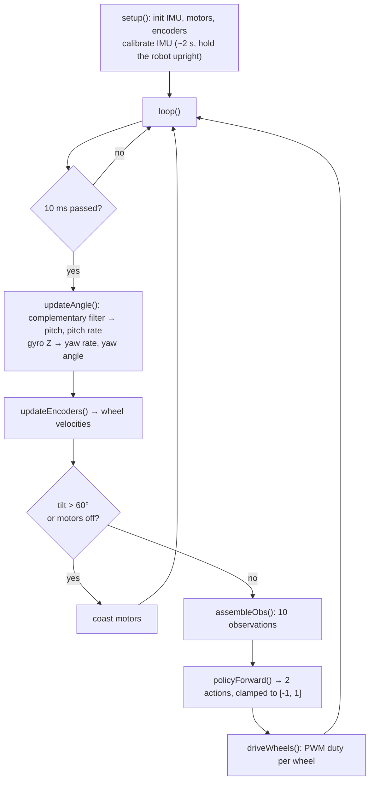

# 7. Sim-to-Real Deployment

The policy is a 1474-parameter network that turns 10 numbers into 2. In this chapter you build the
robot, convert the network to plain C arrays, and run it on an ESP32 that computes those 10 numbers
from its sensors 100 times per second, exactly as the simulator did.

!!! abstract "Learning objectives"
    - Know which simulation choices make the transfer work.
    - Wire the robot and flash the firmware.
    - Convert `policy.onnx` to a C header and verify it.
    - Check every sensor sign before letting the robot go.

## 7.1 Why the policy can work on a real robot

The *reality gap* is everything that differs between the simulator and the real robot. This project
closes it in four ways, all set up in earlier chapters:

| Real-world effect | How the simulation covers it | Where |
|---|---|---|
| Sensor noise | Gaussian noise on every sensor observation | 4.6 |
| Unknown exact mass and balance point | Chassis mass ×0.8–1.2, CoM ±5 mm | 4.8 |
| Gearbox friction, motors not identical | Joint friction randomized, independently per wheel | 4.8 |
| Motor driver reacts late | Actuator delay of 10–40 ms, resampled every episode | 3.4 |
| Delay makes the robot "forget" what it ordered | Previous actions observed | 4.6 |
| Same control rate | 100 Hz in sim and in firmware | 4.3 |

What is **not** randomized must instead be matched exactly: the observation order, units and signs.

## 7.2 Hardware

### Bill of materials

| Component | Qty | Function |
|---|:-:|---|
| JGB37-520 12 V DC gear motor with encoder (11 PPR, 30:1) | 2 | Drives the wheels, reports wheel speed |
| L298N (or similar) dual H-bridge motor driver | 1 | Motor speed and direction |
| 18650 Li-ion cell, 3S (11.1–12.6 V) | 3 | Main power |
| LSM6DS3 IMU (I²C, 0x6B or 0x6A) | 1 | Tilt and rotation |
| ESP32 DevKit (ESP32-WROOM-32) | 1 | Runs sensors, policy and motors |
| 12 V → 5 V buck converter | 1 | Powers the ESP32 |
| WS2812 RGB LED | 1 | Status (green = running, dim red = motors off, bright red = fallen) |
| Chassis, 65 mm wheels, wires | – | Mechanical assembly |

### Wiring

| Module | Pin | ESP32 GPIO |
|---|---|---|
| LSM6DS3 | SDA / SCL | 21 / 22 |
| L298N, left motor | ENA (PWM) / IN1 / IN2 | 15 / 2 / 4 |
| L298N, right motor | ENB (PWM) / IN3 / IN4 | 5 / 19 / 18 |
| Left encoder | A / B | 14 / 26 |
| Right encoder | A / B | 33 / 32 |
| RGB LED | DIN | 27 |

```text
3S battery (+12 V) ──┬──► L298N "12V" ──► motors
                     └──► buck converter ──► 5 V ──► ESP32 "5V"/"VIN"
ESP32 "3V3" ──► LSM6DS3 and both encoders
GND: battery, L298N, buck converter, ESP32, IMU, encoders — ALL connected together
```

!!! danger "Before powering on"
    1. **Connect all grounds together.** A missing common ground is the most common cause of strange
       behavior.
    2. ESP32 pins are **3.3 V only**: power the encoders from 3V3, never 5 V.
    3. Remove the ENA/ENB jumpers on the L298N, or the ESP32 cannot control the speed.
    4. Check the battery polarity with a multimeter before the first power-up.
    5. Mount the IMU firmly near the wheel axle.

## 7.3 Prepare the PC

Allow your user to access USB serial ports (once), then log out and back in:

```bash
curl -fsSL https://raw.githubusercontent.com/platformio/platformio-core/develop/platformio/assets/system/99-platformio-udev.rules \
  | sudo tee /etc/udev/rules.d/99-platformio-udev.rules
sudo udevadm control --reload-rules
sudo udevadm trigger
sudo usermod -a -G dialout,plugdev $USER
sudo apt remove -y brltty      # Ubuntu's braille driver grabs the CH340 USB chip of many ESP32 boards
```

Install the converter's packages in `env_isaaclab`:

```bash
conda activate env_isaaclab
pip install numpy onnx onnxruntime
```

## 7.4 Convert the policy to a C header

```bash
cd ~/RL_SelfBalancingRobot_Training
python tools/export_policy_header.py \
    --model logs/rsl_rl/selfbalancing/<run_folder>/exported/policy.onnx \
    --out firmware/policy_controller/include/policy_weights.h --verify
```

The converter reads the ONNX graph, checks that it is a straight chain of linear layers and
activations (ELU, ReLU, Tanh, Sigmoid), and writes every weight and bias as a `static const float`
array. `--verify` runs the same math in NumPy on 200 random inputs and compares it with ONNX Runtime:

```text
[VERIFY] max|ORT - header| over 200 samples = 5.42e-06 -> OK
[OK] firmware/policy_controller/include/policy_weights.h: 3 layers | 10->32(ELU) -> 32->32(ELU) -> 32->2(NONE)
```

On the ESP32, the forward pass is a few loops:

```cpp
for (int l = 0; l < POLICY_N_LAYERS; l++) {
  for (int j = 0; j < POLICY_LAYER_OUT[l]; j++) {
    float s = POLICY_B[l][j];
    for (int i = 0; i < POLICY_LAYER_IN[l]; i++) s += POLICY_W[l][j * POLICY_LAYER_IN[l] + i] * in[i];
    if (POLICY_LAYER_ACT[l] == ACT_ELU) s = s > 0 ? s : expf(s) - 1.0f;
    out[j] = s;
  }
  swap(in, out);
}
```

No AI runtime is needed on the microcontroller, the timing is predictable, and inference takes tens
of microseconds.

## 7.5 How the firmware rebuilds the observations

[`firmware/policy_controller/src/main.cpp`](https://github.com/LilSun-11/RL_SelfBalancingRobot_Training/blob/master/firmware/policy_controller/src/main.cpp)
runs this loop every 10 ms:



```cpp
void assembleObs(float obs[POLICY_OBS_DIM]) {
  obs[0] = (pitchDeg - PITCH_TRIM_DEG) * DEG_TO_RAD;   // pitch_angle (rad)
  obs[1] = -rateDps * DEG_TO_RAD;                      // pitch_rate: sim uses -d(pitch)/dt
  obs[2] = yawDeg * DEG_TO_RAD;                        // yaw_angle since calibration, [-pi, pi]
  obs[3] = yawRateDps * DEG_TO_RAD;                    // yaw_rate, + = turning left
  obs[4] = wheelLVel;                                  // left wheel (rad/s)
  obs[5] = wheelRVel;                                  // right wheel (rad/s)
  obs[6] = prevAct[0];                                 // previous action, left
  obs[7] = prevAct[1];                                 // previous action, right
  obs[8] = VEL_CMD_MPS;                                // velocity command (m/s)
  obs[9] = YAW_CMD_RAD;                                // heading command (rad)
}
```

- **Pitch**: a complementary filter, `θ = 0.98·(θ + rate·dt) + 0.02·θ_accel`, trusts the gyro for
  fast changes and the accelerometer for the long-term angle.
- **Pitch rate sign**: the simulator's pitch rate is the *negative* of d(pitch)/dt, so the firmware
  flips it. This single sign made the difference between falling and balancing.
- **Yaw**: gyro Z, bias-corrected at calibration. The yaw angle is its integral since calibration
  (the real-robot "spawn heading"). There is no compass, so it drifts slowly over time.
- **Wheel velocity**: encoder counts × 2π / 1320 / Δt, with 1320 = 11 PPR × 30:1 × 4 (quadrature).
- **Previous actions**: clamped to [−1, 1], as `clip_actions` did during training.

The output `u ∈ [−1, 1]` per wheel becomes a 20 kHz PWM duty through a *shaper* that adds a
deadband, a minimum duty to overcome motor stiction, and a duty cap near balance (see
[Motor output shaping](https://github.com/LilSun-11/RL_SelfBalancingRobot_Training/blob/master/firmware/README.md#motor-output-shaping)).

## 7.6 Build and flash

Connect the ESP32 with a **data** USB cable (it appears as `/dev/ttyUSB0`), then:

```bash
cd ~/RL_SelfBalancingRobot_Training/firmware/policy_controller
pio run -t upload        # build and flash (the first build downloads the toolchain)
pio device monitor       # 921600 baud; Ctrl + C to exit, close it before the next upload
```

On boot the firmware calibrates the IMU for ~2 s: **hold the robot upright and still** until it
prints `# CALIB offset=...`, then `# READY MLP 3 lop, obs=10 act=2`.

## 7.7 Serial commands

Type a command and press Enter in the serial monitor. `?` prints all parameters.

| Command | Effect |
|---|---|
| `x` / `o` | Motors off / on |
| `c` | Re-calibrate the IMU (hold the robot upright) |
| `t` | Motor test: both wheels forward, then backward (wheels off the ground) |
| `j` | Wheel mapping test: `act[0]` then `act[1]` alone; must report `OK` twice |
| `v<m/s>` | Velocity command, e.g. `v0.05` (max ±0.1) |
| `y<deg>` | Heading command relative to yaw 0, + = left, e.g. `y30` |
| `h` | Current heading becomes yaw 0, heading command 0 |
| `s<deg>` | Pitch trim (if the robot drifts while "balanced") |
| `m±1`, `g±1`, `i±1`, `z±1` | Motor, gyro X, pitch and gyro Z sign |
| `e±1`, `r±1`, `w0/1` | Left/right encoder sign, swap the two policy outputs between the wheels |

The full list is in [firmware/README.md](https://github.com/LilSun-11/RL_SelfBalancingRobot_Training/blob/master/firmware/README.md#serial-commands).

## 7.8 First run: test one thing at a time

The motors are **on** after boot, so send `x` first.

1. **Pitch.** Tilt the robot by hand: `pitch` is ~0 upright, and `pitch` and `rate` move in the same
   direction (fix with `g-1` / `i-1`).
2. **Yaw.** Turn the robot left (counter-clockwise seen from above): `yaw` (the rate) is positive and
   `yawAng` increases (fix with `z-1`). A wrong yaw sign makes the robot spin in place.
3. **Encoders.** Roll each wheel forward by hand: `velL` / `velR` are positive (fix with `e-1` /
   `r-1`).
4. **Motors.** Wheels off the ground, send `t`: both wheels go forward, then backward (`m-1` or swap
   the motor wires). Then `j`: it must print `OK` for both actions (`w0`/`w1` to swap).
5. **Safety.** Send `o`, tilt past 60°: the motors stop and the LED turns bright red.
6. **Balance.** Hold the robot upright, send `o`, let go gently with a hand ready to catch it.
7. **Commands.** Try `v0.05`, then `v0`; `y30`, then `y0`.

!!! success "Checkpoint"
    The robot balances on its own, drives at the commanded speed, and turns to the commanded heading.
